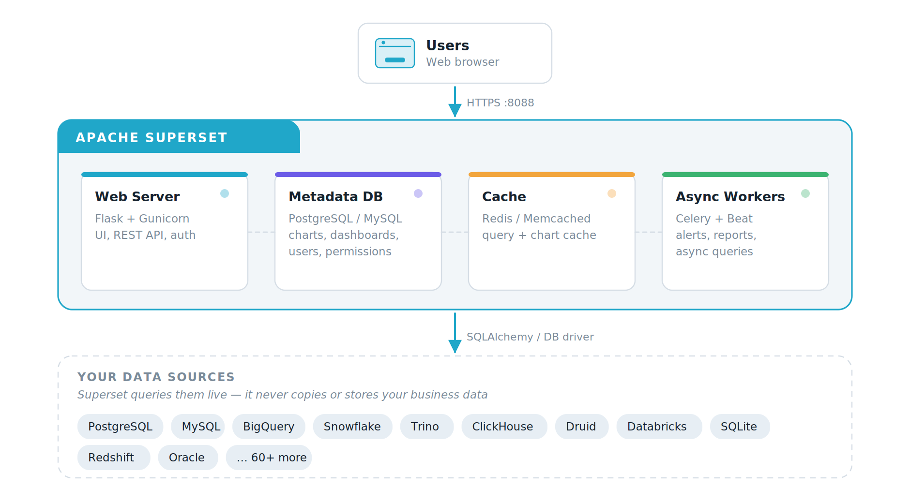
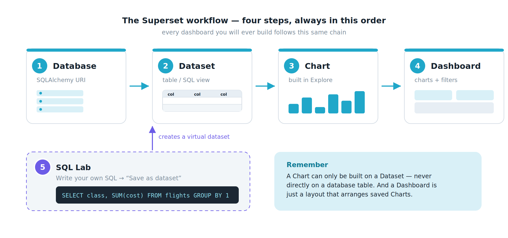

# บทที่ 1 — รู้จัก Apache Superset ใน 10 นาที

## 1.1 Superset คืออะไร

Apache Superset คือโปรแกรมสำหรับสำรวจข้อมูลและสร้างแดชบอร์ด ที่เปิดให้ใช้ฟรีภายใต้ลิขสิทธิ์แบบโอเพนซอร์สของมูลนิธิ Apache Software Foundation พูดง่าย ๆ คือเป็นทางเลือกโอเพนซอร์สของโปรแกรมจำพวก Power BI, Tableau หรือ Looker

จุดที่ทำให้ Superset ต่างจากโปรแกรมอื่นอย่างชัดเจนคือ Superset ไม่มีที่เก็บข้อมูลของตัวเอง มันไม่ดูดข้อมูลของคุณเข้ามาเก็บไว้ แต่จะส่งคำสั่ง SQL ไปถามฐานข้อมูลที่คุณมีอยู่แล้วโดยตรง แล้วนำผลลัพธ์มาวาดเป็นกราฟ ข้อมูลจึงยังอยู่ที่เดิมและใหม่เสมอ

> **แล้ว Superset เก็บอะไรบ้าง**
> Superset เก็บเฉพาะ “คำอธิบายงาน” ของคุณ เช่น กราฟนี้ชื่ออะไร ใช้ตารางไหน จัดกลุ่มด้วยคอลัมน์อะไร วางไว้ตรงไหนบนแดชบอร์ด ใครมีสิทธิ์เห็นบ้าง ทั้งหมดนี้เก็บในฐานข้อมูลเล็ก ๆ ที่เรียกว่า Metadata Database ส่วนตัวเลขยอดขายหรือข้อมูลลูกค้าจริง ๆ ยังคงอยู่ในฐานข้อมูลต้นทางของคุณเสมอ

## 1.2 ทำอะไรได้บ้าง

- กราฟสำเร็จรูปมากกว่า 40 แบบ ตั้งแต่กราฟเส้นธรรมดาไปจนถึงแผนที่เชิงภูมิศาสตร์

- สร้างกราฟแบบไม่ต้องเขียนโค้ด เพียงลากคอลัมน์มาวางในช่องที่กำหนด

- มี SQL Lab เป็นเครื่องมือเขียน SQL ในตัว สำหรับคนที่อยากคุมคำสั่งเอง

- เชื่อมต่อฐานข้อมูลที่พูด SQL ได้เกือบทุกยี่ห้อ ทั้ง PostgreSQL, MySQL, Oracle, SQL Server, BigQuery, Snowflake, Trino, ClickHouse และอีกกว่า 60 ระบบ

- มีระบบแคช (Cache) ช่วยให้กราฟที่เปิดซ้ำแสดงผลเร็วขึ้นมาก

- มี Semantic Layer สำหรับนิยามตัวชี้วัดกลาง เพื่อให้ทุกคนในองค์กรใช้สูตรเดียวกัน

- มีตัวกรองระดับแดชบอร์ด (Native Filters), การกรองข้ามกราฟ (Cross-filter) และการเจาะลึกข้อมูล (Drill to detail / Drill by)

- ปรับแต่งหน้าตาด้วย CSS Template ให้เข้ากับสีขององค์กรได้

- ฝังแดชบอร์ดลงเว็บไซต์อื่น (Embedding) และส่งรายงานอัตโนมัติตามเวลา

## 1.3 สถาปัตยกรรม เห็นภาพรวมก่อนลงมือ

ก่อนติดตั้ง ควรเข้าใจว่า Superset ไม่ใช่โปรแกรมเดียวโดด ๆ แต่ประกอบด้วยส่วนย่อยหลายส่วนที่ทำงานร่วมกัน ตอนติดตั้งด้วย Docker คุณจะเห็นชื่อเหล่านี้โผล่ขึ้นมาเป็น container หลายตัว ซึ่งเป็นเรื่องปกติ

*รูปที่ 1 ส่วนประกอบของ Apache Superset และความสัมพันธ์กับฐานข้อมูลของคุณ*

| **ส่วนประกอบ** | **หน้าที่** | **ถ้าส่วนนี้ล่มจะเกิดอะไร** |
|:---|:---|:---|
| Web Server | แสดงหน้าเว็บ รับคลิกของผู้ใช้ และให้บริการ REST API | เปิดเว็บไม่ได้เลย |
| Metadata Database | เก็บนิยามกราฟ แดชบอร์ด ผู้ใช้ และสิทธิ์ | งานที่บันทึกไว้หายทั้งหมด ต้องสำรองข้อมูลส่วนนี้เสมอ |
| Cache (Redis) | จำผลลัพธ์ที่เคยคิวรีไว้ ทำให้เปิดกราฟซ้ำได้เร็ว | ยังใช้งานได้แต่ช้าลง เพราะต้องไปถามฐานข้อมูลใหม่ทุกครั้ง |
| Celery Worker / Beat | ทำงานเบื้องหลัง เช่น ส่งรายงานตามเวลา แจ้งเตือน คิวรีแบบอะซิงโครนัส | รายงานอัตโนมัติและการแจ้งเตือนไม่ทำงาน |
| ฐานข้อมูลของคุณ | แหล่งข้อมูลจริงที่ Superset ส่ง SQL ไปถาม | กราฟขึ้นข้อความผิดพลาดว่าเชื่อมต่อไม่ได้ |

## 1.4 แนวคิดสำคัญ 5 คำ ที่ต้องเข้าใจก่อนทำอะไรทั้งสิ้น

นี่คือหัวใจของทั้งเล่ม ถ้าเข้าใจ 5 คำนี้ ที่เหลือคือรายละเอียดปลีกย่อยเท่านั้น

*รูปที่ 2 ลำดับการทำงานของ Superset ที่ต้องทำเรียงตามนี้เสมอ*

| **คำศัพท์** | **ความหมายแบบเข้าใจง่าย** | **ทำที่เมนูไหน** |
|:---|:---|:---|
| **Database** | การเชื่อมต่อไปยังฐานข้อมูลหนึ่งตัว เปรียบเหมือนการเสียบสายไฟเข้าปลั๊ก ทำครั้งเดียวใช้ได้ตลอด | \+ ‣ Data ‣ Connect database |
| **Dataset** | ตารางหนึ่งตาราง (หรือผลลัพธ์ของ SQL หนึ่งชุด) ที่คุณอนุญาตให้นำมาสร้างกราฟได้ กราฟทุกกราฟต้องมี Dataset เสมอ | Datasets |
| **Chart** | กราฟหนึ่งรูป เกิดจากการหยิบ Dataset มาเลือกคอลัมน์และตัวชี้วัด บางที่เรียกว่า Slice | Charts หรือหน้า Explore |
| **Dashboard** | หน้ารวมกราฟหลายรูป จัดวางเป็นหน้าเดียว พร้อมตัวกรองใช้ร่วมกัน | Dashboards |
| **SQL Lab** | ห้องทดลองสำหรับเขียน SQL เอง ใช้ตรวจข้อมูลหรือสร้าง Dataset แบบเสมือน | SQL ‣ SQL Lab |

> **กฎเหล็กที่มือใหม่มักพลาด**
> หนึ่ง คุณสร้างกราฟจากตารางในฐานข้อมูลโดยตรงไม่ได้ ต้องประกาศตารางนั้นเป็น Dataset ก่อนเสมอ
> สอง แดชบอร์ดไม่ได้เก็บข้อมูล มันเป็นเพียงการจัดวางกราฟที่บันทึกไว้แล้ว ถ้าลบกราฟทิ้ง ช่องนั้นบนแดชบอร์ดก็จะว่างไปด้วย
> สาม การแก้กราฟหนึ่งรูป จะมีผลกับทุกแดชบอร์ดที่นำกราฟรูปนั้นไปวางไว้

## 1.5 Superset เหมาะกับงานแบบไหน และไม่เหมาะกับอะไร

| **เหมาะมาก** | **ไม่เหมาะ / ควรใช้เครื่องมืออื่น** |
|:---|:---|
| ทำแดชบอร์ดติดตามตัวชี้วัดที่ต้องดูซ้ำ ๆ ทุกวัน | ทำความสะอาดข้อมูลดิบขนาดใหญ่ ควรทำที่ชั้น ETL ก่อน |
| ให้คนจำนวนมากดูข้อมูลเดียวกัน โดยควบคุมสิทธิ์รายกลุ่ม | งานที่ต้องแก้ไขข้อมูลกลับเข้าฐานข้อมูล Superset อ่านอย่างเดียว |
| สำรวจข้อมูลแบบเฉพาะกิจด้วย SQL แล้วเปลี่ยนเป็นกราฟทันที | จัดหน้ารายงานให้สวยระดับสิ่งพิมพ์ ควรใช้โปรแกรมทำเอกสารแทน |
| องค์กรที่มีฐานข้อมูลอยู่แล้วและไม่อยากย้ายข้อมูลไปที่อื่น | วิเคราะห์สถิติชั้นสูงหรือทำโมเดลทำนาย ควรใช้ Python หรือ R |

---

[⟵ 00-เริ่มต้นอ่าน](./00-เริ่มต้นอ่าน.md) · [สารบัญ](./README.md) · [บทที่ 2 — ติดตั้ง Superset บนเครื่องของคุณ ⟶](./02-ติดตั้งเอง.md)
