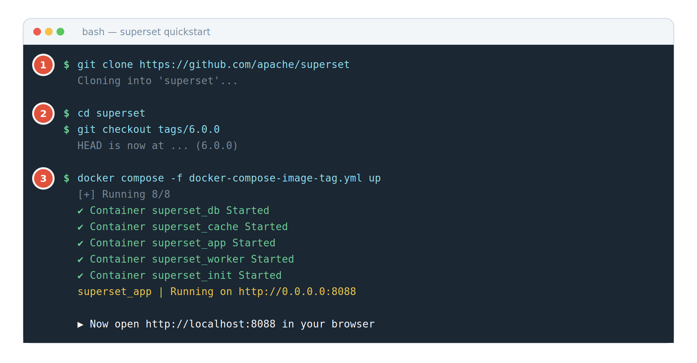
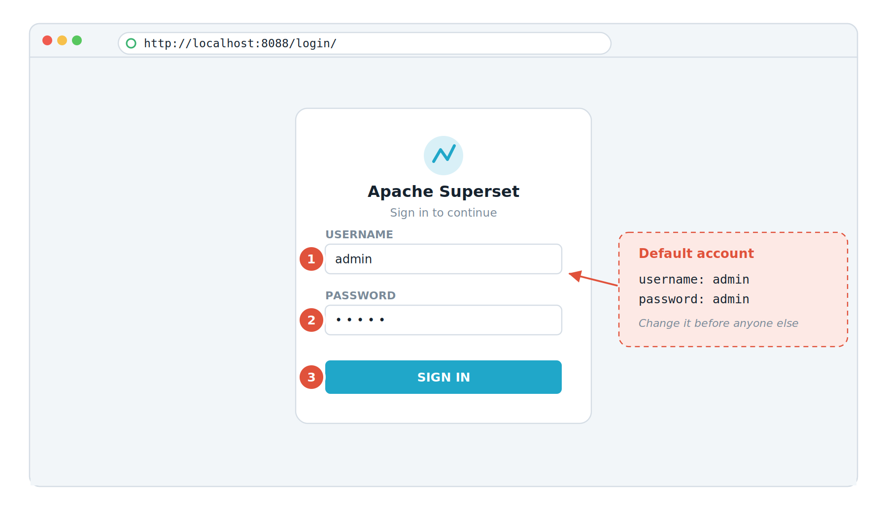

# บทที่ 2 — ติดตั้ง Superset บนเครื่องของคุณ

บทนี้จะพาติดตั้ง Superset ด้วยวิธีที่เร็วและปลอดภัยที่สุดสำหรับการเรียนรู้ นั่นคือใช้ Docker Compose ซึ่งจะยกทุกส่วนประกอบในรูปที่ 1 ขึ้นมาให้พร้อมกันในคำสั่งเดียว

## 2.1 สิ่งที่ต้องเตรียมก่อน

| **สิ่งที่ต้องมี** | **รายละเอียด** | **ตรวจสอบอย่างไร** |
|:---|:---|:---|
| Docker | โปรแกรมจำลองสภาพแวดล้อม ดาวน์โหลด Docker Desktop สำหรับ Windows หรือ macOS ได้ฟรีจาก docker.com | docker --version |
| Docker Compose | ติดมากับ Docker Desktop อยู่แล้ว หากใช้ Linux อาจต้องติดตั้งเพิ่ม | docker compose version |
| Git | โปรแกรมดึงซอร์สโค้ด ดาวน์โหลดจาก git-scm.com | git --version |
| หน่วยความจำ | แนะนำ RAM ว่างอย่างน้อย 8 GB และพื้นที่ดิสก์ว่าง 10 GB | ดูใน Task Manager หรือ Activity Monitor |
| พอร์ต 8088 | ต้องไม่มีโปรแกรมอื่นใช้อยู่ | ถ้าถูกใช้อยู่ ให้ปิดโปรแกรมนั้นก่อน |

> **ตรวจก่อนเริ่ม**
> เปิดโปรแกรม Terminal (macOS/Linux) หรือ PowerShell (Windows) แล้วพิมพ์คำสั่งในคอลัมน์ขวาของตารางข้างบนทีละบรรทัด ถ้าทุกคำสั่งตอบกลับมาเป็นเลขรุ่น แปลว่าพร้อมแล้ว หากคำสั่งใดขึ้นว่า command not found ให้กลับไปติดตั้งโปรแกรมนั้นก่อน
> อย่าลืมเปิดโปรแกรม Docker Desktop ค้างไว้ด้วย ถ้าไม่เปิด คำสั่ง docker ทุกคำสั่งจะขึ้นว่าเชื่อมต่อไม่ได้

## 2.2 ติดตั้งด้วย 3 คำสั่ง

เปิด Terminal หรือ PowerShell ขึ้นมา แล้วทำตามนี้ทีละขั้น อย่าข้าม



*รูปที่ 3 หน้าตา Terminal เมื่อรันคำสั่งทั้งสามขั้นสำเร็จ*

**① ดึงซอร์สโค้ด** — คำสั่ง git clone จะสร้างโฟลเดอร์ชื่อ superset ในตำแหน่งที่คุณอยู่ ใช้เวลาสักครู่

**② เลือกรุ่นที่เป็นทางการ** — คำสั่ง git checkout จะย้อนโค้ดกลับไปยังรุ่นที่ทดสอบแล้ว แทนที่จะใช้โค้ดล่าสุดที่อาจยังไม่เสถียร

**③ สั่งให้ทุก container ทำงาน** — รอจนกว่าจะเห็นข้อความ Running on http://0.0.0.0:8088 อย่าปิดหน้าต่างนี้

พิมพ์ทีละบรรทัด แล้วกด Enter รอให้แต่ละบรรทัดเสร็จก่อนพิมพ์บรรทัดถัดไป

```bash
# ขั้นที่ 1 ดึงซอร์สโค้ดจาก GitHub
git clone https://github.com/apache/superset
# ขั้นที่ 2 เข้าไปในโฟลเดอร์ แล้วเลือกรุ่นทางการล่าสุด
cd superset
git checkout tags/6.0.0
# ขั้นที่ 3 สั่งให้ Superset ทำงาน
docker compose -f docker-compose-image-tag.yml up
```

> **ขั้นที่ 3 จะใช้เวลานาน อย่าเพิ่งตกใจ**
> ครั้งแรก Docker ต้องดาวน์โหลด image ขนาดหลาย GB และติดตั้งข้อมูลตัวอย่างให้ด้วย บนอินเทอร์เน็ตความเร็วปกติอาจใช้เวลา 10–20 นาที ระหว่างนี้จะมีข้อความวิ่งเต็มจอ ซึ่งเป็นเรื่องปกติ
> ให้รอจนข้อความหยุดวิ่ง และเห็นบรรทัดที่มีคำว่า Running on http://0.0.0.0:8088 จึงถือว่าเสร็จ

> **ห้ามนำวิธีนี้ไปใช้กับระบบงานจริง**
> Docker Compose เหมาะกับการทดลองและการพัฒนาเท่านั้น เอกสารทางการระบุชัดว่าไม่แนะนำสำหรับ production หากต้องการเปิดใช้จริงในองค์กร ให้ติดตั้งบน Kubernetes ด้วย Helm chart ทางการแทน และต้องเปลี่ยนค่า SECRET_KEY กับรหัสผ่านทั้งหมดก่อนเสมอ

## 2.3 เข้าสู่ระบบครั้งแรก

เปิดเว็บเบราว์เซอร์ แล้วพิมพ์ที่อยู่ต่อไปนี้ในช่อง URL

```bash
http://localhost:8088
```


*รูปที่ 4 หน้าจอเข้าสู่ระบบครั้งแรก*

**① ช่อง Username** — พิมพ์คำว่า admin

**② ช่อง Password** — พิมพ์คำว่า admin เช่นกัน

**③ ปุ่ม Sign in** — กดหนึ่งครั้ง แล้วระบบจะพาเข้าหน้า Home

> **เปลี่ยนรหัสผ่าน admin ทันทีที่เข้าได้**
> บัญชี admin/admin เป็นค่าเริ่มต้นที่ทุกคนบนโลกรู้ ถ้าเครื่องของคุณเปิดให้เครือข่ายอื่นเข้าถึงได้ ถือว่าอันตรายมาก
> วิธีเปลี่ยน คลิกไอคอนผู้ใช้มุมขวาบน ‣ Info ‣ Reset my password หรือไปที่ Settings ‣ Manage ‣ List Users แล้วแก้ไขบัญชี admin

## 2.4 คำสั่งจัดการที่ต้องรู้

หน้าต่าง Terminal ที่รันคำสั่ง up ค้างอยู่นั้นคือ “สวิตช์ไฟ” ของ Superset ถ้าปิดหน้าต่างนั้น Superset จะหยุดทำงาน ต่อไปนี้คือคำสั่งที่ใช้บ่อย ให้เปิด Terminal หน้าต่างใหม่แล้ว cd เข้าโฟลเดอร์ superset ก่อนใช้ทุกครั้ง

| **สิ่งที่อยากทำ** | **คำสั่ง** | **หมายเหตุ** |
|:---|:---|:---|
| หยุดใช้งานชั่วคราว | docker compose stop | ข้อมูลยังอยู่ครบ เปิดใหม่ได้ทันที เป็นวิธีที่ปลอดภัยที่สุด |
| เปิดใช้งานอีกครั้ง | docker compose start | เร็วกว่าครั้งแรกมาก เพราะไม่ต้องดาวน์โหลดใหม่ |
| เปิดแบบทำงานเบื้องหลัง | docker compose -f docker-compose-image-tag.yml up -d | เติม -d ท้ายคำสั่ง จะได้ปิดหน้าต่าง Terminal ได้ |
| ปิดและลบ container | docker compose down | ข้อมูลยังอยู่ใน volume แต่ควรสั่ง stop ก่อนเสมอเพื่อกันข้อมูลเสียหาย |
| ดูว่าตัวไหนทำงานอยู่ | docker compose ps | ควรเห็นสถานะ running หรือ healthy ทุกแถว |
| ดูข้อความผิดพลาด | docker compose logs -f superset_app | ใช้เมื่อเปิดเว็บไม่ขึ้น กด Ctrl + C เพื่อออก |

## 2.5 ปัญหาที่พบบ่อยตอนติดตั้ง

| **อาการ** | **สาเหตุ** | **วิธีแก้** |
|:---|:---|:---|
| ขึ้นข้อความ services.superset-worker-beat.env_file.0 must be a string | ใช้ docker-compose รุ่นเก่า | อัปเดต Docker Desktop และเปลี่ยนไปใช้คำสั่ง docker compose แบบเว้นวรรค แทน docker-compose ที่มีขีดกลาง |
| เปิด localhost:8088 แล้วขึ้นว่าเชื่อมต่อไม่ได้ | container ยังทำงานไม่เสร็จ | รออีก 2–3 นาที แล้วรีเฟรช หากยังไม่ได้ให้ดู log ด้วยคำสั่งในตารางข้อ 2.4 |
| ขึ้นว่า port is already allocated | มีโปรแกรมอื่นใช้พอร์ต 8088 อยู่ | ปิดโปรแกรมนั้น หรือแก้พอร์ตในไฟล์ docker-compose แล้วเปิดที่พอร์ตใหม่แทน |
| ดาวน์โหลด image ค้างหรือหลุดกลางคัน | อินเทอร์เน็ตไม่เสถียร หรือติดพร็อกซีขององค์กร | สั่งคำสั่งเดิมซ้ำอีกครั้ง Docker จะดาวน์โหลดต่อจากของเดิม หากอยู่หลังพร็อกซีให้ตั้งค่าพร็อกซีใน Docker Desktop ก่อน |
| เข้าระบบแล้วไม่เห็นข้อมูลตัวอย่างเลย | container ชื่อ superset_init ยังทำงานไม่จบ | รอจนกว่า superset_init จะแสดงสถานะ exited (0) แล้วรีเฟรชหน้าเว็บ |

---

## 2.6 หมายเหตุอัปเดต — เทียบกับเอกสารทางการรุ่นปัจจุบัน

เนื้อหาบทนี้เขียนตอนอ้างอิงรุ่น **6.0.0** ตอนนี้เอกสารทางการทำไว้ถึง **6.1.0** และมี 3 จุดที่เปลี่ยนไป
ถ้าทำตามบทข้างบนแล้วไม่ตรง ให้ยึดตามนี้

### 1. ที่อยู่เอกสารทางการย้ายแล้ว

| เดิม | ปัจจุบัน |
|---|---|
| `superset.apache.org/docs/...` | `superset.apache.org/user-docs/...` (สำหรับผู้ใช้) |
| | `superset.apache.org/admin-docs/6.1.0/...` (สำหรับผู้ดูแล) |
| | `superset.apache.org/developer-docs/...` (สำหรับนักพัฒนา + API reference) |

### 2. คำสั่งดึงซอร์สโค้ดแบบทางการ

เอกสารทางการเปลี่ยนมาใช้ `--depth=1` ซึ่งเร็วกว่าและกินดิสก์น้อยกว่ามาก
เพราะไม่ต้องดึงประวัติทั้งหมดของโครงการซึ่งใหญ่หลาย GB

```bash
git clone --depth=1 https://github.com/apache/superset.git
cd superset
export TAG=6.1.0
git fetch --depth=1 origin tag $TAG
git checkout $TAG
docker compose -f docker-compose-image-tag.yml up
```

> **บน Windows PowerShell ใช้ `export` ไม่ได้**
> เปลี่ยนสองบรรทัดกลางเป็น `$env:TAG = "6.1.0"` แล้ว `git fetch --depth=1 origin tag $env:TAG`

### 3. ตอนนี้มีไฟล์ compose ให้เลือก 4 แบบ

| ไฟล์ | เหมาะกับ | พอร์ต |
|---|---|---|
| `docker-compose-image-tag.yml` | **เรียนตามคู่มือเล่มนี้** — ใช้ image ของรุ่นทางการ ไม่ต้อง build | 8088 |
| `docker-compose-light.yml` | เครื่องแรม/ซีพียูน้อย เบาที่สุด | 9001 |
| `docker-compose-non-dev.yml` | ใช้ image สำเร็จรูป ไม่ build frontend | 8088 |
| `docker-compose.yml` | นักพัฒนา ต้องรอ container `superset-node` build เสร็จก่อนหน้าเว็บถึงจะขึ้น | 8088 |

> **ถ้าเครื่องอืดจนใช้ไม่ได้ ให้ลอง `docker-compose-light.yml` ก่อนยอมแพ้**
> อย่าลืมว่าพอร์ตจะเป็น 9001 ไม่ใช่ 8088 ตอนเปิดเบราว์เซอร์

### 4. ข้อมูลตัวอย่างที่จะใช้ในแล็บ

แล็บของวิชานี้ใช้ `tutorial_flights.csv` ซึ่งเป็นชุดข้อมูลเดียวกับที่เอกสารทางการใช้
ถ้าติดตั้งเองแล้วอยากทำแล็บให้ครบ ให้โหลดด้วยคำสั่งนี้ (จากโฟลเดอร์ที่เก็บนี้)

```bash
python setup/ผู้ดูแล/โหลดข้อมูลตัวอย่าง.py
```

---

[⟵ บทที่ 1 — รู้จัก Apache Superset ใน 10 นาที](./01-รู้จัก-superset.md) · [สารบัญ](./README.md) · [บทที่ 3 — ทัวร์หน้าจอ รู้ว่าปุ่มไหนอยู่ตรงไหน ⟶](./03-ทัวร์หน้าจอ.md)
