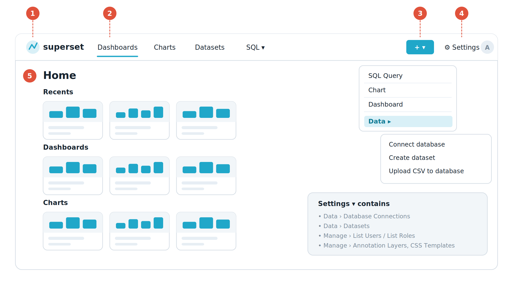

# บทที่ 3 — ทัวร์หน้าจอ รู้ว่าปุ่มไหนอยู่ตรงไหน

ก่อนลงมือทำงานจริง ขอพาเดินดูหน้าจอสักรอบ เพราะเมนูของ Superset ซ่อนของสำคัญไว้ในที่ที่คนใหม่มักหาไม่เจอ

*รูปที่ 5 แถบเมนูด้านบนและเมนูย่อยที่ต้องใช้บ่อยที่สุด*

**① โลโก้ Superset** — คลิกเมื่อไรก็ได้เพื่อกลับหน้า Home

**② เมนูหลัก** — Dashboards, Charts, Datasets และ SQL คือรายการของทุกอย่างที่คุณและเพื่อนร่วมงานสร้างไว้

**③ ปุ่ม + สีฟ้า** — ปุ่มสร้างของใหม่ทั้งหมด ทั้งฐานข้อมูล ชุดข้อมูล กราฟ แดชบอร์ด และคิวรี ปุ่มนี้คือปุ่มที่คุณจะใช้บ่อยที่สุด

**④ เมนู Settings** — รวมงานตั้งค่า ทั้งการเชื่อมต่อฐานข้อมูล การจัดการผู้ใช้และสิทธิ์ Annotation Layers และ CSS Templates

**⑤ หน้า Home** — รวมของที่คุณเพิ่งเปิด ของที่กดดาวไว้ และของที่คุณสร้างเอง

## 3.1 เส้นทางลัดที่ควรจำ

| **อยากทำอะไร** | **เส้นทางเมนู** |
|:---|:---|
| เชื่อมต่อฐานข้อมูลใหม่ | \+ ‣ Data ‣ Connect database หรือ Settings ‣ Data ‣ Database Connections |
| อัปโหลดไฟล์ CSV หรือ Excel | \+ ‣ Data ‣ Upload CSV to database |
| ประกาศตารางเป็น Dataset | \+ ‣ Data ‣ Create dataset หรือ เมนู Datasets ‣ ปุ่ม + Dataset |
| สร้างกราฟใหม่ | \+ ‣ Chart หรือ คลิกชื่อ Dataset จากรายการ Datasets |
| สร้างแดชบอร์ดเปล่า | \+ ‣ Dashboard |
| เขียน SQL เอง | SQL ‣ SQL Lab |
| ดูคิวรีที่เคยรัน | SQL ‣ Query history |
| เพิ่มผู้ใช้หรือกำหนดสิทธิ์ | Settings ‣ Manage ‣ List Users / List Roles |
| ใส่เส้นเหตุการณ์ลงบนกราฟ | Settings ‣ Manage ‣ Annotation Layers |

## 3.2 หน้า Home

หน้า Home คือหน้าแรกหลังเข้าสู่ระบบ แบ่งเป็นแถบตามลำดับดังนี้

- Recents คือสิ่งที่คุณเพิ่งเปิดล่าสุด ใช้กลับไปทำงานต่อได้เร็วที่สุด

- Dashboards, Charts และ Saved queries แสดงรายการงานของคุณ โดยสลับดูได้ระหว่างแท็บ Favorite (ที่กดดาวไว้), Mine (ที่คุณสร้าง) และ Examples (ตัวอย่างที่ติดมากับระบบ)

- ใช้ไอคอนรูปดาว ☆ กดค้างไว้กับงานที่ใช้ประจำ เพื่อให้ขึ้นมาอยู่บนสุดเสมอ

> **ลองเล่นตัวอย่างก่อนสร้างของตัวเอง**
> ถ้าติดตั้งด้วย Docker Compose ระบบจะแถมฐานข้อมูลชื่อ examples พร้อมแดชบอร์ดตัวอย่างมาให้หลายชุด ลองเปิด Dashboards แล้วคลิกดูสัก 2–3 อัน กดตัวกรอง กดที่แท่งกราฟ เพื่อให้คุ้นมือก่อนเริ่มบทถัดไป การรื้อของตัวอย่างไม่ทำให้อะไรพัง เพราะสร้างใหม่ได้ตลอด

> **สัปดาห์แรกคุณต้องสร้างแดชบอร์ดของตัวเองแล้ว**
> ชื่อ `csi414_<รหัสนักศึกษา>` พร้อมกล่องข้อความสำหรับเขียนบันทึกประจำสัปดาห์
> ซึ่งเป็นกติกาที่ใช้ต่อเนื่องไปจนจบเทอมและมีคะแนนทุกสัปดาห์
> วิธีสร้างกล่องและกติกาเต็มอยู่ที่
> [บทที่ 8 หัวข้อ 8.2.1 บันทึกประจำสัปดาห์](./08-ประกอบแดชบอร์ด.md#821-บันทึกประจำสัปดาห์--กติกาเฉพาะของวิชานี้)
> ส่วนลำดับขั้นแบบจับมือทำอยู่ในใบงานของสัปดาห์นั้น

---

[⟵ บทที่ 2 — ติดตั้ง Superset บนเครื่องของคุณ](./02-ติดตั้งเอง.md) · [สารบัญ](./README.md) · [บทที่ 4 — เชื่อมต่อฐานข้อมูล ⟶](./04-เชื่อมต่อฐานข้อมูล.md)
