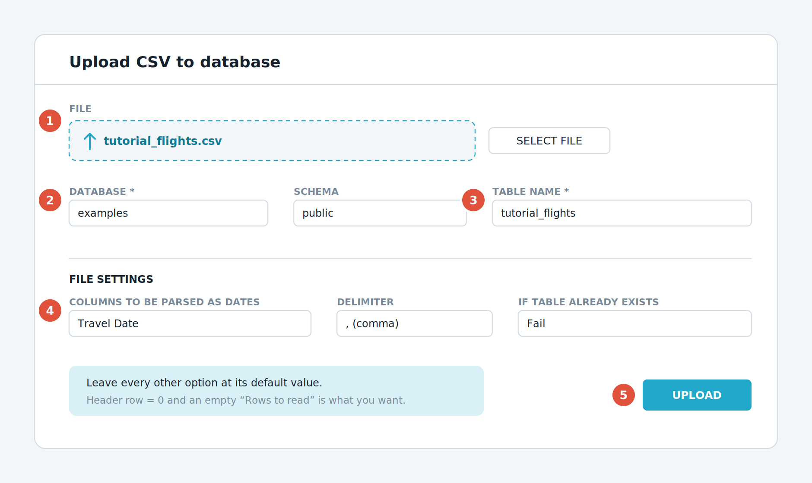
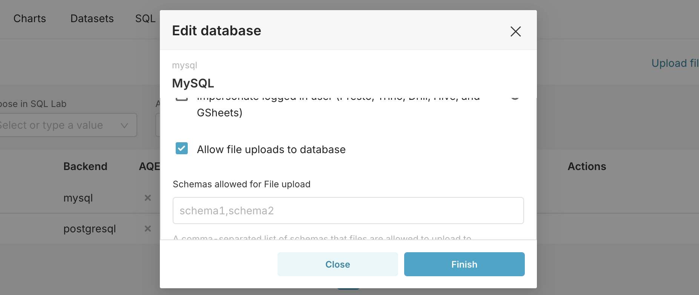
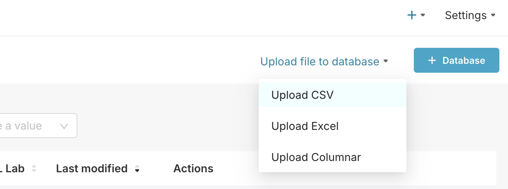
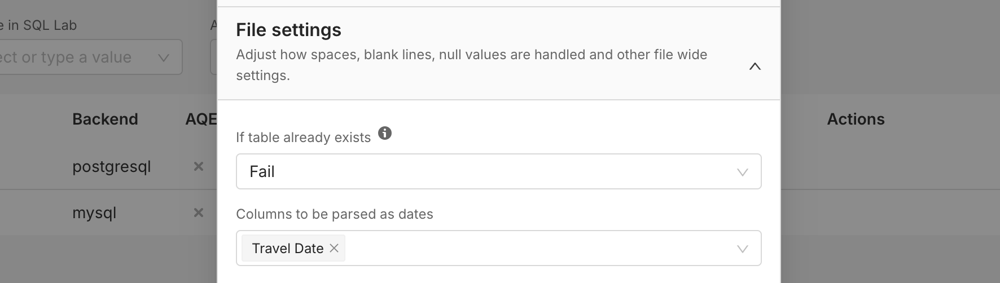
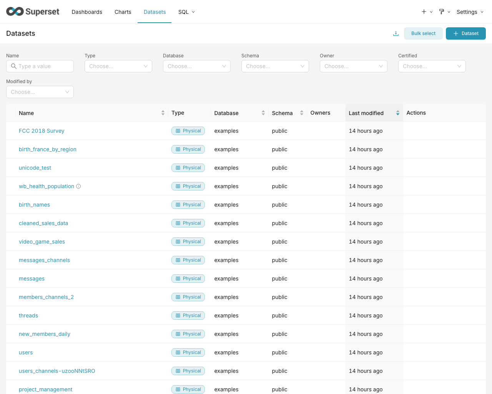
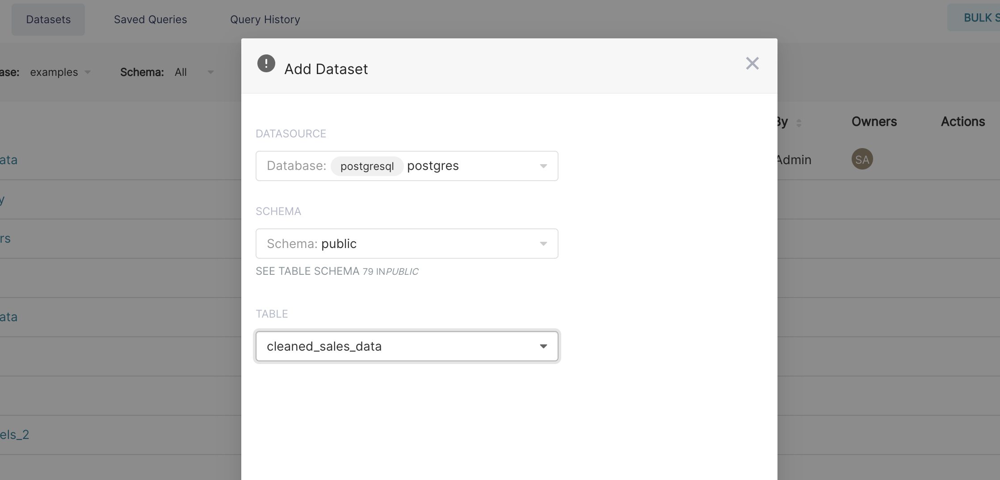
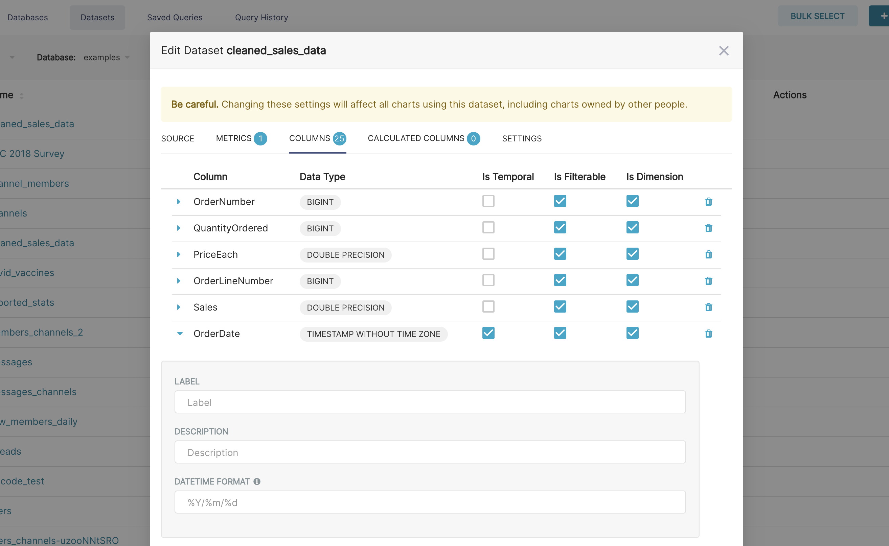
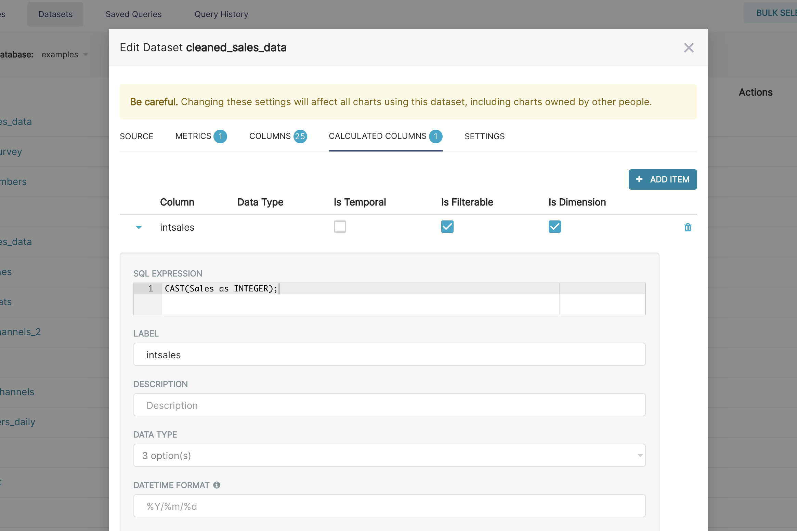
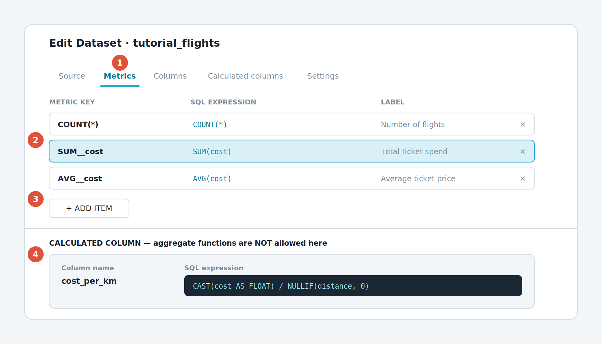
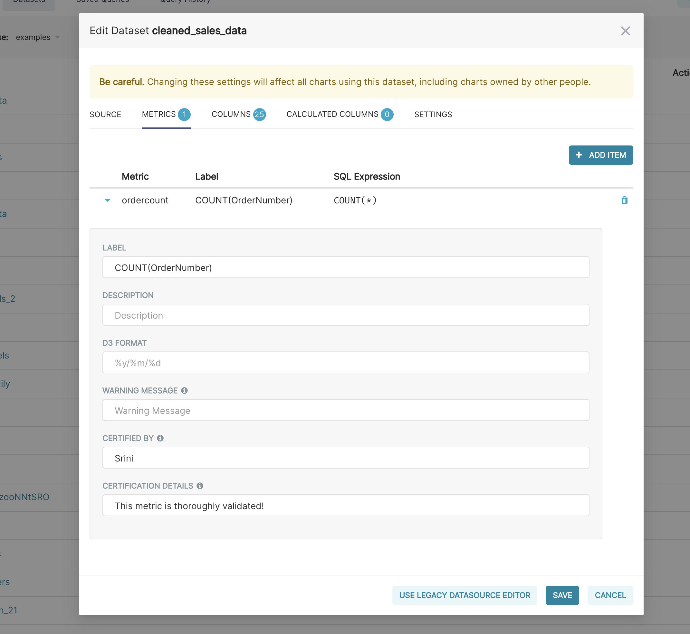

# บทที่ 5 — นำข้อมูลเข้า และสร้าง Dataset

บทนี้คือขั้นที่ 2 ของรูปที่ 2 เราจะเริ่มจากนำไฟล์ CSV ตัวอย่างขึ้นระบบ เพื่อให้ทุกคนที่อ่านคู่มือเล่มนี้มีข้อมูลชุดเดียวกันไว้ฝึก

## 5.1 เตรียมไฟล์ตัวอย่างสำหรับฝึก

ข้อมูลตัวอย่างที่จะใช้ตลอดเล่มคือรายการเดินทางด้วยเครื่องบินของพนักงานองค์กรแห่งหนึ่งในสหราชอาณาจักร ปี ค.ศ. 2011 มีคอลัมน์ที่น่าสนใจดังนี้

| **คอลัมน์** | **ความหมาย** | **ชนิดข้อมูล** |
|:---|:---|:---|
| Travel Date | วันที่เดินทาง | วันที่ |
| Travel Class | ชั้นโดยสาร ได้แก่ Economy, Premium Economy, Business, First Class | ข้อความ |
| Department | หน่วยงานของผู้เดินทาง เปลี่ยนชื่อเป็น Orange, Yellow, Purple เพื่อปกปิดข้อมูลจริง | ข้อความ |
| Cost | ราคาตั๋ว | ตัวเลข |
| Distance | ระยะทางระหว่างต้นทางถึงปลายทาง หน่วยกิโลเมตร | ตัวเลข |
| Ticket Single or Return | ตั๋วเที่ยวเดียวหรือไป-กลับ | ข้อความ |
| Origin / Destination | ต้นทางและปลายทาง | ข้อความ |

ดาวน์โหลดไฟล์ tutorial_flights.csv ได้จากคลังตัวอย่างของโครงการ Superset บน GitHub ที่ชื่อ apache-superset/examples-data โดยไฟล์อยู่ในชื่อ tutorial_flights.csv บันทึกลงเครื่องไว้ก่อน

## 5.2 อัปโหลดไฟล์ CSV ขึ้นเป็นตาราง

> **อย่าลืมเปิดสวิตช์ก่อน**
> ต้องเปิด Allow file uploads to database ตามหัวข้อ 4.4 ให้เรียบร้อยก่อน มิฉะนั้นเมนูอัปโหลดจะไม่ขึ้น

*รูปที่ 7 หน้าจออัปโหลดไฟล์ CSV เข้าฐานข้อมูล*

**① ช่องเลือกไฟล์** — กด Select file แล้วเลือก tutorial_flights.csv ที่ดาวน์โหลดไว้

**② ช่อง Database** — เลือก examples หรือฐานข้อมูลที่คุณเปิดสิทธิ์อัปโหลดไว้

**③ ช่อง Table Name** — พิมพ์ว่า tutorial_flights ชื่อนี้จะกลายเป็นชื่อตารางในฐานข้อมูล

**④ Columns to be parsed as dates** — พิมพ์ว่า Travel Date ช่องนี้สำคัญมาก ถ้าไม่กรอก Superset จะมองวันที่เป็นข้อความ ทำให้สร้างกราฟตามเวลาไม่ได้

**⑤ ปุ่ม Upload** — กดแล้วรอสักครู่ ระบบจะพากลับไปหน้ารายการเมื่อสำเร็จ

เส้นทางเข้าหน้านี้คือ + ‣ Data ‣ Upload CSV to database หรือเข้าทาง Settings ‣ Data ‣ Database Connections แล้วเลือก Upload file to database ‣ Upload CSV

> **ช่อง Columns to be parsed as dates คือจุดที่คนพลาดมากที่สุด**
> ต้องพิมพ์ชื่อคอลัมน์ให้ตรงเป๊ะทั้งตัวพิมพ์ใหญ่เล็กและช่องว่าง ในที่นี้คือ Travel Date มีเว้นวรรคหนึ่งครั้ง หากพิมพ์ผิด ระบบจะไม่แจ้งเตือน แต่คุณจะไปพบปัญหาตอนสร้างกราฟตามเวลาแล้วหาคอลัมน์เวลาไม่เจอ

> 📷 **ภาพหน้าจอจริงจากเอกสารทางการ (5 ภาพ)** — ที่มาและสัญญาอนุญาตอยู่ใน [`ATTRIBUTIONS.md`](../ATTRIBUTIONS.md)

*เข้าไปแก้ระเบียนฐานข้อมูล `examples`*

*ติ๊ก **Allow file uploads to database** ในแท็บ Advanced ‣ Security*

*เมนู **Upload file to database ‣ Upload CSV***

*เลือก database/schema แล้วตั้งชื่อตาราง `tutorial_flights`*

*ระบุ **Travel Date** เป็นคอลัมน์วันที่ (ถ้าลืม กราฟเส้นจะทำไม่ได้ทั้งแล็บ)*

## 5.3 ประกาศตารางเป็น Dataset

ถ้าอัปโหลดผ่านหน้า Upload CSV ระบบจะสร้าง Dataset ให้อัตโนมัติ แต่ถ้าตารางของคุณมีอยู่ในฐานข้อมูลอยู่แล้ว ต้องประกาศเองด้วยขั้นตอนนี้

1.  ไปที่เมนู Datasets ด้านบน

2.  กดปุ่ม + Dataset มุมขวาบน

3.  เลือก Database ที่เชื่อมต่อไว้

4.  เลือก Schema เช่น public

5.  เลือก Table ที่ต้องการ เช่น cleaned_sales_data หรือ tutorial_flights

6.  กดปุ่ม Add มุมขวาล่าง จะเห็นชุดข้อมูลใหม่ปรากฏในรายการ

> 📷 **ภาพหน้าจอจริงจากเอกสารทางการ (2 ภาพ)** — ที่มาและสัญญาอนุญาตอยู่ใน [`ATTRIBUTIONS.md`](../ATTRIBUTIONS.md)

*หน้ารายการ Datasets*

*หน้าต่างเพิ่ม Dataset ใหม่*

## 5.4 Dataset แบบกายภาพ กับแบบเสมือน

| **ประเภท** | **คืออะไร** | **เหมาะกับ** |
|:---|:---|:---|
| **Physical dataset** | ชี้ตรงไปยังตารางหรือวิวจริงในฐานข้อมูล หนึ่งตารางต่อหนึ่ง Dataset | ตารางที่สะอาดพร้อมใช้อยู่แล้ว ประสิทธิภาพดีที่สุด |
| **Virtual dataset** | เก็บคำสั่ง SQL ไว้แทนชื่อตาราง Superset จะนำ SQL นั้นไปครอบเป็นตารางย่อยตอนคิวรี | ต้องรวมหลายตาราง กรองบางแถวออก หรือคำนวณคอลัมน์ใหม่ก่อนใช้ |

วิธีสร้าง Virtual dataset ที่ง่ายที่สุดคือเขียน SQL ใน SQL Lab แล้วกด Save ‣ Save dataset ซึ่งจะอธิบายละเอียดในบทที่ 9

## 5.5 จัดระเบียบ Dataset ด้วยโฟลเดอร์

เมื่อ Dataset เริ่มเยอะ หน้ารายการจะรก Superset จึงมีระบบโฟลเดอร์ให้จัดกลุ่ม

1.  ที่หน้า Datasets มองหาแผง Folders ทางแถบด้านซ้าย

2.  กด + New Folder เพื่อสร้างโฟลเดอร์ระดับบนสุด หรือลากโฟลเดอร์หนึ่งไปวางในอีกโฟลเดอร์เพื่อทำโฟลเดอร์ย่อย

3.  ลากแถวของ Dataset ไปวางบนโฟลเดอร์ หรือคลิกขวาที่ Dataset แล้วเลือก Move to folder

> **โฟลเดอร์ไม่ใช่ระบบสิทธิ์**
> โฟลเดอร์เป็นเครื่องมือจัดระเบียบส่วนตัวของแต่ละคนเท่านั้น การย้าย Dataset เข้าโฟลเดอร์ไม่ได้เปลี่ยนสิทธิ์การเข้าถึง และไม่มีผลต่อสิ่งที่ผู้ใช้คนอื่นเห็น หากต้องการจำกัดสิทธิ์ ให้ใช้ Roles ตามบทที่ 10

## 5.6 ตั้งค่าคุณสมบัติของคอลัมน์

หลังประกาศ Dataset แล้ว ควรเข้าไปตรวจคุณสมบัติของคอลัมน์เสียก่อน เพราะมีผลโดยตรงกับสิ่งที่คุณจะเลือกได้ตอนสร้างกราฟ เข้าได้โดยชี้เมาส์ที่แถวของ Dataset แล้วกดไอคอนดินสอ Edit

| **คุณสมบัติ** | **ความหมาย** | **ผลถ้าไม่ติ๊ก** |
|:---|:---|:---|
| Is temporal | เป็นคอลัมน์เวลา ใช้เป็นแกนเวลาได้ | จะเลือกคอลัมน์นี้เป็นแกนเวลาของกราฟไม่ได้ |
| Is filterable | ให้ใช้เป็นตัวกรองได้ | คอลัมน์จะไม่ขึ้นในรายการตัวกรอง |
| Is dimension | เป็นมิติสำหรับจัดกลุ่ม | จะลากมาใส่ช่อง Dimensions ไม่ได้ |
| Datetime format | รูปแบบวันที่ตามมาตรฐาน ISO-8601 เช่น %Y-%m-%d | Superset อาจแปลงวันที่ผิดหรือแปลงไม่ได้ |
| Description | คำอธิบายคอลัมน์ | ผู้ใช้จะไม่เห็นคำอธิบายเมื่อชี้เมาส์ที่หัวคอลัมน์ในกราฟตาราง |

> 📷 **ภาพหน้าจอจริงจากเอกสารทางการ (2 ภาพ)** — ที่มาและสัญญาอนุญาตอยู่ใน [`ATTRIBUTIONS.md`](../ATTRIBUTIONS.md)

*ตั้งคุณสมบัติคอลัมน์ (temporal / filterable / รูปแบบวันที่)*

*คอลัมน์คำนวณ*

## 5.7 Semantic Layer นิยามตัวชี้วัดกลางให้ทั้งองค์กร

นี่คือคุณสมบัติที่ทำให้ Superset ต่างจากเครื่องมือวาดกราฟทั่วไป คุณสามารถนิยามสูตรคำนวณไว้ที่ Dataset ครั้งเดียว แล้วทุกคนที่สร้างกราฟจากชุดข้อมูลนี้จะได้สูตรเดียวกันทั้งหมด ไม่ต้องมานั่งเถียงกันว่ายอดขายสุทธิของใครถูก

*รูปที่ 8 หน้าต่างแก้ไข Dataset ในแท็บ Metrics และส่วนของ Calculated column*

**① แท็บ Metrics** — ที่เก็บสูตรตัวชี้วัดทั้งหมด กดที่แท็บนี้เพื่อเริ่ม

**② หนึ่งแถวคือหนึ่งตัวชี้วัด** — ประกอบด้วยชื่อคีย์ สูตร SQL และป้ายชื่อที่ผู้ใช้จะเห็น

**③ ปุ่ม + Add item** — กดเพื่อเพิ่มตัวชี้วัดใหม่

**④ Calculated column** — คอลัมน์คำนวณ ใช้แปลงค่าทีละแถว ห้ามใส่ฟังก์ชันรวมยอด

### ความต่างที่ต้องแยกให้ออก

|  | **Metric (ตัวชี้วัด)** | **Calculated column (คอลัมน์คำนวณ)** |
|:---|:---|:---|
| ทำอะไร | รวมยอดจากหลายแถวให้เหลือค่าเดียว | แปลงค่าทีละแถว ผลลัพธ์ยังมีจำนวนแถวเท่าเดิม |
| ใช้ฟังก์ชันรวมได้ไหม | ได้ และควรใช้ เช่น SUM, COUNT, AVG | ไม่ได้เด็ดขาด ระบบจะแจ้งข้อผิดพลาด |
| ตัวอย่าง | SUM(cost) | CAST(cost AS FLOAT) / NULLIF(distance,0) |
| ตัวอย่างที่ซับซ้อนขึ้น | SUM(recovered) / SUM(confirmed) | UPPER(department) |
| ไปโผล่ที่ไหน | รายการ METRICS ในหน้า Explore | รายการ COLUMNS ในหน้า Explore |

### ลองสร้างตัวชี้วัดแรก

1.  เปิดหน้าแก้ไข Dataset ของ tutorial_flights แล้วไปที่แท็บ Metrics

2.  กด + Add item จะได้แถวว่างขึ้นมาหนึ่งแถว

3.  ช่อง Metric key พิมพ์ว่า total_cost ซึ่งเป็นชื่อภายในระบบ ห้ามเว้นวรรค

4.  ช่อง SQL expression พิมพ์ว่า SUM(cost)

5.  ช่อง Label พิมพ์ว่า ยอดค่าตั๋วรวม ซึ่งเป็นชื่อที่ผู้ใช้จะเห็นบนกราฟ

6.  กด Save มุมขวาล่าง จากนี้ตัวชี้วัดนี้จะขึ้นให้เลือกในทุกกราฟที่ใช้ชุดข้อมูลนี้

> **รับรองตัวชี้วัดด้วยเครื่องหมาย Certified**
> ในหน้าแก้ไขตัวชี้วัด มีช่องให้ระบุผู้รับรอง (Certified by) และรายละเอียดการรับรอง เมื่อกรอกแล้วจะมีไอคอนติดหน้าชื่อ ช่วยให้เพื่อนร่วมงานรู้ว่าสูตรนี้ผ่านการตรวจสอบแล้ว ควรใช้กับตัวชี้วัดสำคัญขององค์กร

> 📷 **ภาพหน้าจอจริงจากเอกสารทางการ (1 ภาพ)** — ที่มาและสัญญาอนุญาตอยู่ใน [`ATTRIBUTIONS.md`](../ATTRIBUTIONS.md)

*ตัวชี้วัดกลาง (virtual metric)*

---

## 5.8 บนเซิร์ฟเวอร์ของวิชา ขั้นตอนในบทนี้อาจารย์ทำให้แล้ว

บทนี้ทั้งบทเป็นงานของ **ผู้ดูแลระบบ** ไม่ใช่ของผู้ใช้ทั่วไป

เอกสารความปลอดภัยทางการระบุว่า ผู้ใช้ role **Gamma** ซึ่งเป็น role ของนักศึกษา
**อัปโหลดไฟล์ CSV ไม่ได้ และสร้าง Dataset เองไม่ได้** ทำได้แค่สร้างกราฟและแดชบอร์ด
จาก Dataset ที่ได้รับสิทธิ์แล้วเท่านั้น

| อยากทำขั้นตอนในบทนี้จริง ๆ | ทำได้ที่ไหน |
|---|---|
| ดูอาจารย์ทำ | คาบสาธิต 10 นาที ก่อนเริ่มแล็บ 1 |
| ลงมือทำเองทุกปุ่ม | ติดตั้ง Superset บนเครื่องตัวเอง ([บทที่ 2](./02-ติดตั้งเอง.md)) แล้วคุณจะเป็น Admin |

> **ทำไมถึงไม่เปิดสิทธิ์นี้ให้นักศึกษา**
> ผู้ที่อัปโหลดไฟล์เข้าฐานข้อมูลได้ ก็สร้างตารางในฐานข้อมูลของวิชาได้ด้วย
> ห้องเรียน 24 คนอัปโหลดไฟล์ชนกันเมื่อไร ตารางของทุกคนพังพร้อมกัน
> นี่เป็นเหตุผลเดียวกับที่ระบบงานจริงไม่ให้ผู้ใช้ทั่วไปมีสิทธิ์นี้

**Dataset ที่เตรียมไว้ให้แล้วบนเซิร์ฟเวอร์ของวิชา**

ทุกชุดมาจากที่เก็บทางการ `apache-superset/examples-data` ไม่มีชุดใดมาจากที่อื่น

| Dataset | แถว | ใช้ในแล็บ |
|---|---:|---|
| `tutorial_flights` | 2,954 | แล็บ 1–6 ขั้น guided · ชุดที่เอกสารทางการใช้ในบท Exploring Data |
| `video_game_sales` | 16,595 | แล็บ 1 และ 6 ขั้น Challenge |
| `flight_data` | 55,105 | แล็บ 3 ขั้น Challenge และแล็บ 4 |
| `airports` | 322 | แล็บ 4 · ตารางอ้างอิงไว้ JOIN |
| `san_francisco` | 261,552 | แล็บ 7 · ชุดที่ deck.gl ในเอกสารทางการใช้เดโม |

---

[⟵ บทที่ 4 — เชื่อมต่อฐานข้อมูล](./04-เชื่อมต่อฐานข้อมูล.md) · [สารบัญ](./README.md) · [บทที่ 6 — สร้างกราฟแรกด้วยหน้า Explore ⟶](./06-สร้างกราฟแรก.md)
