# บทที่ 6 — สร้างกราฟแรกด้วยหน้า Explore

มาถึงขั้นที่สนุกที่สุดแล้ว บทนี้จะพาสร้างกราฟ 3 แบบด้วยมือตัวเอง โดยใช้ชุดข้อมูล tutorial_flights ที่เตรียมไว้ในบทที่ 5

## 6.1 รู้จักหน้า Explore ก่อน

หน้า Explore คือเครื่องมือสร้างกราฟแบบไม่ต้องเขียนโค้ด เปิดได้ 2 ทาง คือคลิกชื่อ Dataset จากหน้า Datasets หรือกด + ‣ Chart แล้วเลือกชุดข้อมูลกับชนิดกราฟ

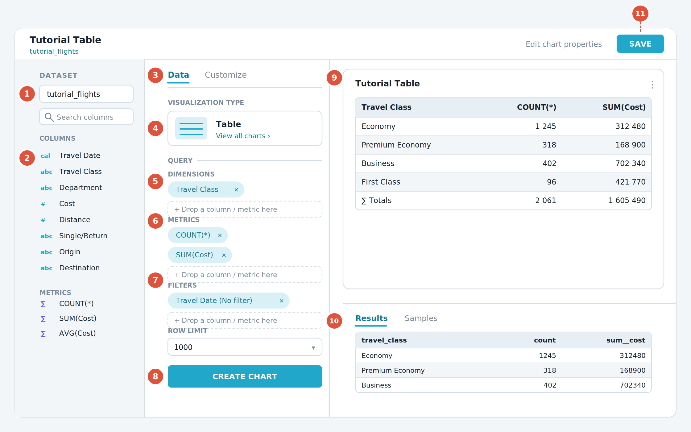

*รูปที่ 9 ผังหน้าจอ Explore ทั้งหมด ควรกลับมาดูรูปนี้ทุกครั้งที่หาปุ่มไม่เจอ*

**① ชื่อ Dataset ที่ใช้อยู่** — คลิกจุดสามจุดข้าง ๆ เพื่อสลับชุดข้อมูล หรือเปิดหน้าแก้ไข Dataset

**② รายการ Columns และ Metrics** — ของทั้งหมดที่ชุดข้อมูลนี้มี ใช้ช่องค้นหาด้านบนช่วยหาได้ ตัวอักษรหน้าชื่อบอกชนิดข้อมูล คือ abc หมายถึงข้อความ \# หมายถึงตัวเลข และ cal หมายถึงวันที่

**③ แท็บ Data และ Customize** — แท็บ Data ใช้กำหนดว่าจะแสดงข้อมูลอะไร ส่วนแท็บ Customize ใช้แต่งหน้าตา เช่น สี ป้ายแกน

**④ Visualization type** — ชนิดกราฟที่ใช้อยู่ กด View all charts เพื่อเปลี่ยนเป็นแบบอื่น มีให้เลือกกว่า 40 แบบ

**⑤ ช่อง Dimensions** — คอลัมน์ที่ใช้จัดกลุ่ม เทียบได้กับ GROUP BY ในภาษา SQL

**⑥ ช่อง Metrics** — ตัวเลขที่ต้องการวัด เช่น จำนวนแถวหรือผลรวม ลากมาวางหรือคลิกเพื่อเลือกได้

**⑦ ช่อง Filters** — เงื่อนไขกรองข้อมูล รวมถึงช่วงเวลาที่ต้องการดู

**⑧ ปุ่ม Create chart หรือ Run** — ทุกครั้งที่แก้ค่าใด ๆ ต้องกดปุ่มนี้ กราฟจึงจะอัปเดต

**⑨ พื้นที่แสดงกราฟ** — ผลลัพธ์ที่ได้ ชี้เมาส์บนกราฟจะเห็นรายละเอียด คลิกขวาเพื่อเปิดเมนูเจาะลึก

**⑩ แถบ Results และ Samples** — Results คือข้อมูลที่กราฟใช้จริง ส่วน Samples คือข้อมูลดิบตัวอย่าง มีประโยชน์มากเวลาสงสัยว่าตัวเลขมาจากไหน

**⑪ ปุ่ม Save** — บันทึกกราฟ และเลือกได้ว่าจะใส่ลงแดชบอร์ดไหน

> **กราฟไม่เปลี่ยนทั้งที่แก้ค่าแล้ว**
> เกือบทุกครั้งเป็นเพราะยังไม่ได้กดปุ่ม Create chart หรือ Run ที่ตำแหน่ง ⑧ Superset ไม่อัปเดตกราฟให้อัตโนมัติ เพื่อไม่ให้ยิงคิวรีไปรบกวนฐานข้อมูลทุกครั้งที่คุณขยับเมาส์

## 6.2 ปฏิบัติการที่ 1 ตารางสรุปจำนวนและค่าใช้จ่ายตามชั้นโดยสาร

เป้าหมาย ตารางที่บอกว่าแต่ละชั้นโดยสารมีการเดินทางกี่ครั้ง และใช้เงินรวมเท่าไร

1.  ไปที่เมนู Datasets แล้วคลิกชื่อ tutorial_flights ระบบจะพาเข้าหน้า Explore ทันที

2.  ที่ Visualization type ตรวจว่าเป็น Table ถ้าไม่ใช่ให้กด View all charts แล้วเลือก Table

3.  กดที่ช่อง Filters ซึ่งมีค่าเริ่มต้นเป็นช่วงเวลาย้อนหลัง 1 สัปดาห์ ในหน้าต่างที่เปิดขึ้นให้เปลี่ยน Range type เป็น No filter แล้วกด Apply ขั้นนี้สำคัญมาก เพราะข้อมูลตัวอย่างเป็นของปี 2011 ถ้าไม่เปลี่ยนจะไม่มีข้อมูลขึ้นเลย

4.  ที่ช่อง Dimensions ให้เลือกคอลัมน์ Travel Class

5.  ที่ช่อง Metrics ให้เลือก COUNT(\*) ซึ่งหมายถึงจำนวนแถว

6.  กดที่ช่อง Metrics อีกครั้งเพื่อเพิ่มตัวที่สอง เลือกแท็บ Simple แล้วเลือกคอลัมน์ Cost กับฟังก์ชัน SUM จะได้ SUM(Cost)

7.  กดปุ่ม Create chart จะเห็นตารางสรุป 4 แถวตามชั้นโดยสาร

> **ทำไมข้อมูลไม่ขึ้น**
> ค่าเริ่มต้นของ Superset จะแสดงข้อมูลย้อนหลังเพียง 1 สัปดาห์เท่านั้น ทุกครั้งที่ใช้ข้อมูลเก่าหรืออยากดูทั้งชุด อย่าลืมเปลี่ยนช่วงเวลาเป็น No filter ก่อน นี่คือสาเหตุอันดับหนึ่งที่มือใหม่เจอหน้าจอว่างเปล่า

### บันทึกกราฟและสร้างแดชบอร์ดไปพร้อมกัน

1.  กดปุ่ม Save มุมขวาบน

2.  เลือกตัวเลือก Save as แล้วตั้งชื่อกราฟว่า Tutorial Table

3.  ที่ช่อง Add to dashboard ให้พิมพ์ชื่อใหม่ว่า Tutorial Dashboard ระบบจะเสนอให้สร้างแดชบอร์ดใหม่ตามชื่อนั้น

4.  กดปุ่ม Save & go to dashboard ระบบจะบันทึกกราฟ สร้างแดชบอร์ด และพาไปที่แดชบอร์ดนั้นทันที

> 📷 **ภาพหน้าจอจริงจากเอกสารทางการ (8 ภาพ)** — ที่มาและสัญญาอนุญาตอยู่ใน [`ATTRIBUTIONS.md`](../ATTRIBUTIONS.md)

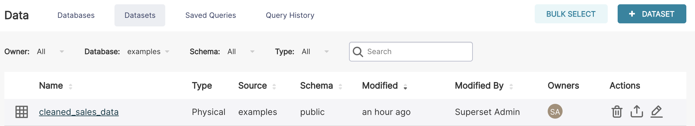

*เปิด Explore จากชื่อ Dataset*

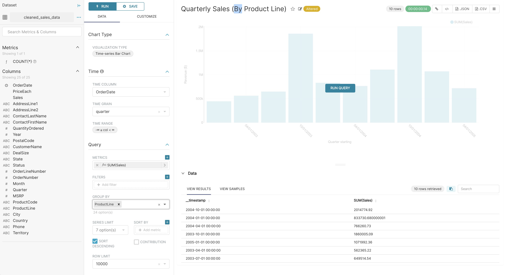

*ตำแหน่งปุ่ม **Run***

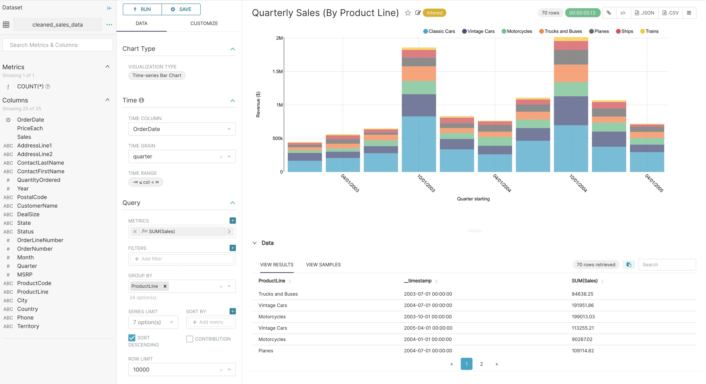

*แท็บ Data / Customize*

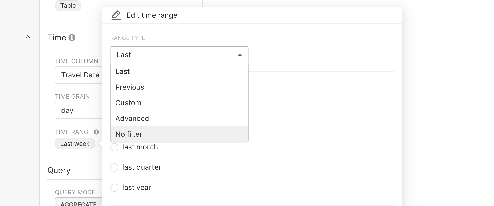

*ตั้ง Time Range เป็น **No Filter** เพื่อให้เห็นข้อมูลทั้งหมด*

*ใส่ metric `COUNT(*)` และ `SUM(Cost)`*

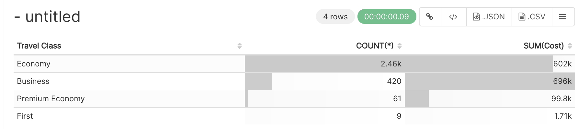

*ผลลัพธ์: ตารางสรุปตามชั้นโดยสาร*

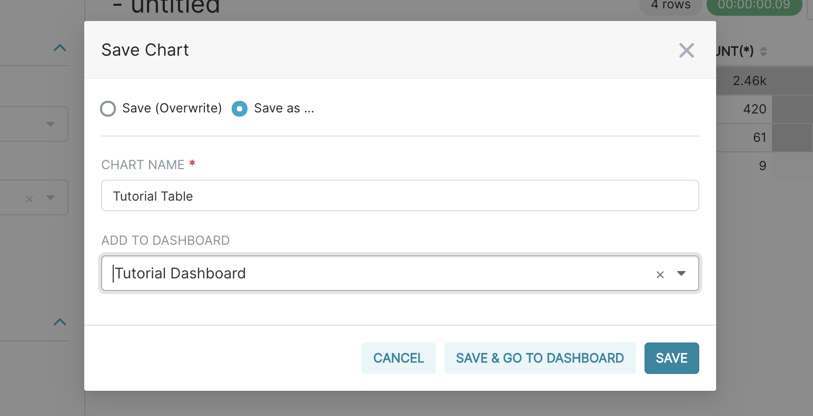

*บันทึกกราฟ*

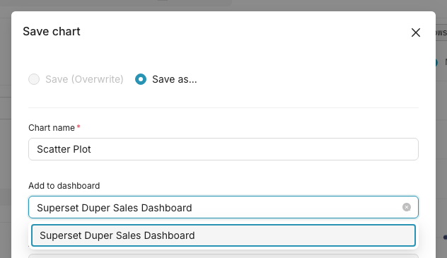

*บันทึกกราฟเข้าแดชบอร์ด*

## 6.3 ปฏิบัติการที่ 2 ตารางไขว้ Pivot Table

เป้าหมาย ตารางที่แสดงค่าใช้จ่ายรายเดือนในครึ่งปีแรกของ 2011 โดยแยกเป็นคอลัมน์ตามหน่วยงานและชั้นโดยสาร

1.  กดปุ่ม + มุมขวาบน แล้วเลือก Chart

2.  เลือกชุดข้อมูล tutorial_flights และเลือกชนิดกราฟ Pivot Table โดยพิมพ์คำว่า pivot ในช่องค้นหาเพื่อหาให้เร็วขึ้น แล้วกด Create new chart

3.  ที่ส่วนเวลา ให้ Time column เป็น Travel Date ซึ่งระบบมักเลือกให้อัตโนมัติเพราะมีคอลัมน์เวลาเดียว

4.  ตั้ง Time grain เป็น Month เพราะถ้าดูรายวันจะละเอียดเกินกว่าจะเห็นแนวโน้ม

5.  ตั้ง Time range เป็นแบบ Custom โดยกำหนดวันเริ่มต้นเป็น 1 มกราคม 2011 และวันสิ้นสุดเป็น 30 มิถุนายน 2011 เคล็ดลับคือกดที่ชื่อเดือนแล้วกดที่ปี จะเลื่อนไปยังวันที่ไกล ๆ ได้เร็วขึ้นมาก

6.  ในส่วน Query ให้ลบตัวชี้วัดเริ่มต้น COUNT(\*) ออก แล้วเพิ่มคอลัมน์ Cost โดยใช้ฟังก์ชัน SUM

7.  ที่ช่อง Rows หรือ Group by ให้เลือก Time ระบบจะใช้คอลัมน์เวลาและระดับเวลาที่ตั้งไว้ให้เอง

8.  ที่ช่อง Columns ให้เลือก Department ก่อน แล้วตามด้วย Travel Class

9.  กด Create chart จะได้ตารางที่มีเดือนเป็นแถว และหน่วยงานกับชั้นโดยสารเป็นคอลัมน์

10. กด Save ตั้งชื่อว่า Tutorial Pivot Table แล้วเลือกเพิ่มเข้า Tutorial Dashboard ที่สร้างไว้แล้ว

> **สังเกตสัญลักษณ์หน้าชื่อคอลัมน์**
> Superset บอกชนิดข้อมูลด้วยสัญลักษณ์เล็ก ๆ ทางซ้ายของชื่อ คือ abc สำหรับข้อความ # สำหรับตัวเลข และไอคอนนาฬิกาหรือปฏิทินสำหรับเวลา ใช้ดูอย่างรวดเร็วว่าคอลัมน์ไหนเอามาบวกได้ คอลัมน์ไหนเอามาจัดกลุ่มได้

> 📷 **ภาพหน้าจอจริงจากเอกสารทางการ (3 ภาพ)** — ที่มาและสัญญาอนุญาตอยู่ใน [`ATTRIBUTIONS.md`](../ATTRIBUTIONS.md)

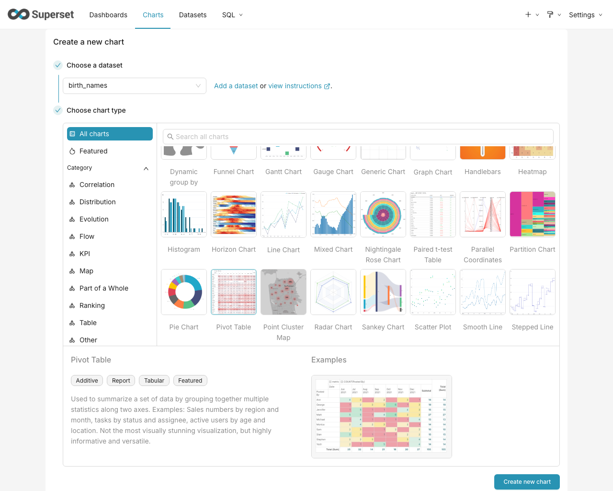

*เลือกชนิดกราฟ Pivot Table*

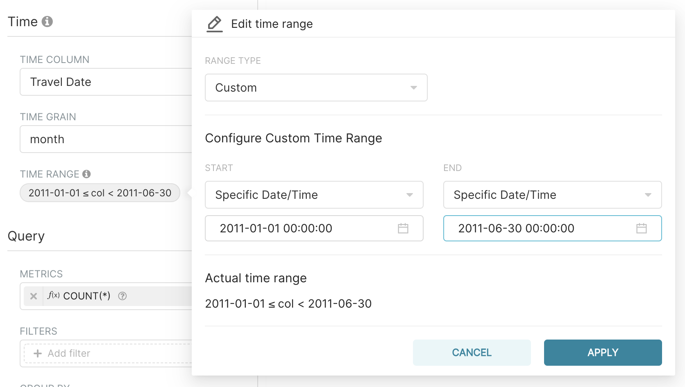

*ตั้งช่วงเวลา 1 ม.ค. – 30 มิ.ย. 2011*

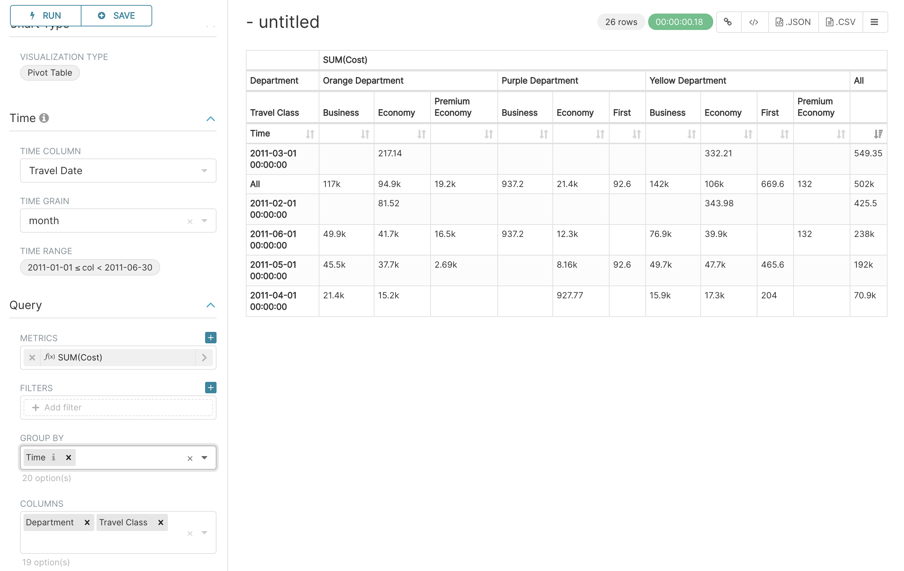

*ผลลัพธ์: เดือน × แผนก × ชั้นโดยสาร*

## 6.4 ปฏิบัติการที่ 3 กราฟเส้นราคาตั๋วเฉลี่ยรายเดือน

เป้าหมาย กราฟเส้นที่แสดงราคาตั๋วเฉลี่ยรายเดือนตลอดทั้งชุดข้อมูล แยกเส้นระหว่างตั๋วเที่ยวเดียวกับตั๋วไป-กลับ

1.  สร้างกราฟใหม่จาก + ‣ Chart เลือก tutorial_flights และชนิดกราฟ Line Chart

2.  ตั้ง Time column เป็น Travel Date และ Time grain เป็น Month

3.  ตั้ง Time range เป็น No filter เพราะครั้งนี้อยากเห็นข้อมูลทั้งชุด

4.  ที่ Metrics ให้ลบ COUNT(\*) ออก แล้วเพิ่ม Cost โดยเลือกฟังก์ชัน AVG จะได้ AVG(Cost)

5.  กด Create chart จะเห็นเส้นเดียวที่มียอดพุ่งขึ้นในเดือนธันวาคม

6.  เพิ่มมิติที่ช่อง Dimensions โดยเลือก Ticket Single or Return แล้วกด Create chart อีกครั้ง คราวนี้จะได้สองเส้นแยกกัน และจะเห็นว่ายอดที่พุ่งในเดือนธันวาคมมาจากตั๋วไป-กลับ

7.  สลับไปแท็บ Customize เพื่อแต่งหน้าตา ลองเปลี่ยน Color scheme ตั้ง Show range filter เป็น No และใส่ข้อความในช่อง X Axis label กับ Y Axis label

8.  กด Save ตั้งชื่อว่า Tutorial Line Chart แล้วเพิ่มเข้า Tutorial Dashboard

> 📷 **ภาพหน้าจอจริงจากเอกสารทางการ (2 ภาพ)** — ที่มาและสัญญาอนุญาตอยู่ใน [`ATTRIBUTIONS.md`](../ATTRIBUTIONS.md)

*เปลี่ยน metric เป็น `AVG(Cost)`*

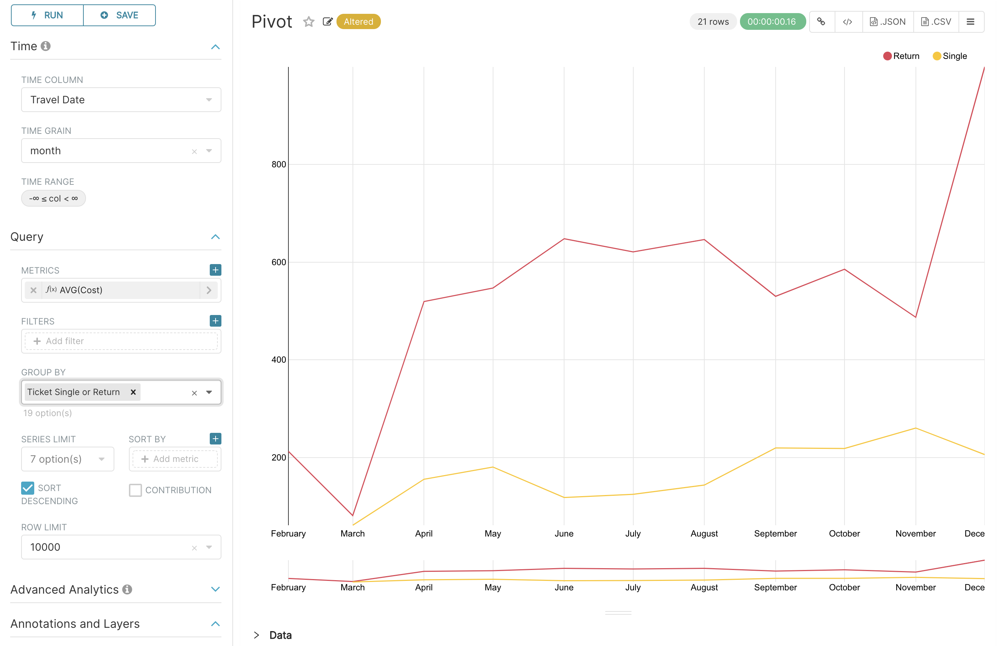

*ผลลัพธ์: ราคาตั๋วเฉลี่ยรายเดือน แยกเส้นตั๋วเที่ยวเดียว/ไป-กลับ*

## 6.5 เลือกชนิดกราฟให้ถูกกับคำถาม

| **คำถามที่อยากตอบ** | **ชนิดกราฟที่แนะนำ** |
|:---|:---|
| ตัวเลขนี้เปลี่ยนแปลงอย่างไรตามเวลา | Line Chart, Area Chart, Time-series Bar Chart |
| กลุ่มไหนมากกว่ากัน | Bar Chart, Pie Chart (ใช้เมื่อกลุ่มไม่เกิน 5–6 กลุ่ม) |
| ตัวเลขสำคัญตัวเดียวตอนนี้เท่าไร | Big Number, Big Number with Trendline |
| อยากเห็นตัวเลขละเอียดครบทุกบรรทัด | Table, AG Grid Interactive Table |
| อยากดูข้อมูลไขว้สองมิติพร้อมกัน | Pivot Table, Heatmap |
| สัดส่วนของแต่ละส่วนย่อยในภาพรวม | Pie Chart, Treemap, Sunburst |
| ความสัมพันธ์ระหว่างตัวเลขสองตัว | Scatter Plot, Bubble Chart |
| ข้อมูลตามพื้นที่ภูมิศาสตร์ | Country Map, deck.gl Scatterplot, MapBox |
| ขั้นตอนที่คนหลุดออกไปทีละขั้น | Funnel Chart |

> **เริ่มจาก Table เสมอ**
> ก่อนสร้างกราฟสวย ๆ ให้ลองทำเป็น Table ธรรมดาก่อนหนึ่งรอบ เพื่อยืนยันว่าตัวเลขถูกต้อง เมื่อมั่นใจแล้วค่อยกด View all charts แล้วเปลี่ยนชนิดกราฟ ค่าที่ตั้งไว้ส่วนใหญ่จะติดตามไปด้วย วิธีนี้ช่วยให้จับข้อผิดพลาดได้ตั้งแต่ต้น

## 6.6 ลูกเล่นเพิ่มเติมของกราฟตาราง

### การใส่สีตามเงื่อนไข (Conditional Formatting)

กราฟชนิด Table ใส่สีพื้นหลังเซลล์ตามค่าได้ ตั้งค่าได้ที่แท็บ Customize

- คอลัมน์ตัวเลข ใส่สีเมื่อค่าสูงหรือต่ำกว่าเกณฑ์ที่กำหนด หรือไล่เฉดสีตามช่วงค่า

- คอลัมน์ข้อความ ใส่สีเมื่อข้อความตรงกับค่าที่ระบุหรือเข้ากับรูปแบบที่กำหนด

- คอลัมน์ค่าตรรกะ ใส่สีแยกกรณี true, false, null และ not null

- แต่ละกฎมีสวิตช์ Use gradient หากเปิดจะไล่ความเข้มตามระยะห่างจากเกณฑ์ หากปิดจะลงสีทึบเท่ากันทุกเซลล์ที่เข้าเงื่อนไข

- เลือกสีได้อิสระจากจานสี หรือใช้ชุดสีสำเร็จที่ผูกกับธีม เช่น success, warning, error ซึ่งจะเปลี่ยนตามธีมสว่างหรือมืดโดยอัตโนมัติ

- ถ้าคอลัมน์นั้นเปิดการเปรียบเทียบเวลาไว้ จะมีชุดสี Trend colors ให้เลือก ทำให้ค่าที่เพิ่มขึ้นเป็นสีเขียวและลดลงเป็นสีแดง หรือสลับกันได้

### แสดงผล HTML ในเซลล์

เปิดสวิตช์ Render HTML รายคอลัมน์ได้ที่แผง Column Configuration ทำให้ใส่ลิงก์ ป้ายสี หรือไอคอนลงในเซลล์ได้

> **เปิด Render HTML เฉพาะข้อมูลที่คุณควบคุมเอง**
> การแสดงผล HTML จากข้อมูลที่ไม่น่าเชื่อถือ เปิดช่องให้เกิดการโจมตีแบบ cross-site scripting (XSS) ได้ อย่าเปิดสวิตช์นี้กับคอลัมน์ที่รับข้อความจากผู้ใช้ภายนอก

### AG Grid Interactive Table

เป็นกราฟตารางรุ่นเต็มสำหรับข้อมูลจำนวนมากที่ต้องแบ่งหน้า จุดเด่นคือมีตัวกรองรายคอลัมน์ที่ทำงานฝั่งเซิร์ฟเวอร์ จึงกรองจากข้อมูลทั้งชุด ไม่ใช่แค่หน้าที่โหลดมาแล้ว

| **ชนิดคอลัมน์** | **ตัวกรองที่ใช้ได้**                                     |
|:-------------|:----------------------------------------------------|
| ข้อความ       | Contains, equals, starts with, ends with            |
| ตัวเลข        | Equals, not equal, less than, greater than, between |
| วันที่          | Before, after, between, blank                       |
| ชุดค่า         | เลือกจากรายการค่าที่ไม่ซ้ำกัน                              |

แต่ละคอลัมน์รวมหลายเงื่อนไขด้วย AND หรือ OR ได้ ส่วนตัวกรองจากคนละคอลัมน์จะถูกรวมด้วย AND เสมอ เนื่องจากตัวกรองถูกแปลงเป็นเงื่อนไข WHERE ในคำสั่ง SQL การแบ่งหน้าจึงทำงานบนผลลัพธ์ที่กรองแล้วเสมอ

### รูปแบบสกุลเงินอัตโนมัติ

1.  เปิดหน้าแก้ไข Dataset แล้วไปที่แท็บ Advanced

2.  ตั้งค่า Currency Code Column ให้ชี้ไปยังคอลัมน์ที่เก็บรหัสสกุลเงินตามมาตรฐาน ISO 4217 เช่น THB, USD, EUR

3.  กลับมาที่หน้า Explore เปิดส่วน Number format ของตัวชี้วัด แล้วเลือก Auto-detect

เมื่อเปิดใช้แล้ว แต่ละแถวจะแสดงสกุลเงินตามค่าในคอลัมน์นั้น ทำให้กราฟเดียวแสดงได้หลายสกุลเงินพร้อมกันโดยจัดรูปแบบถูกต้องทุกแถว

---

[⟵ บทที่ 5 — นำข้อมูลเข้า และสร้าง Dataset](./05-นำข้อมูลเข้าและ-dataset.md) · [สารบัญ](./README.md) · [บทที่ 7 — Advanced Analytics คำนวณเพิ่มจากผลลัพธ์ ⟶](./07-advanced-analytics.md)
