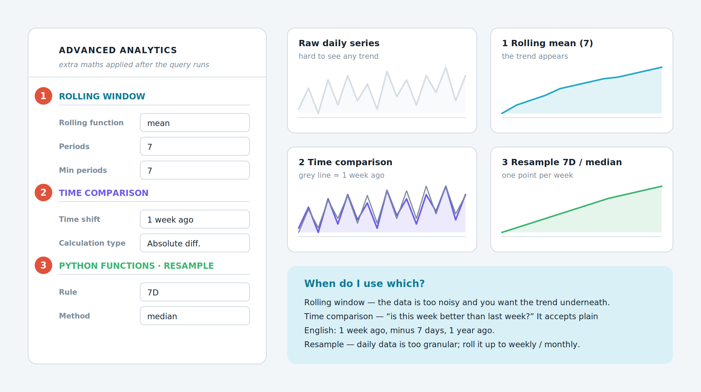
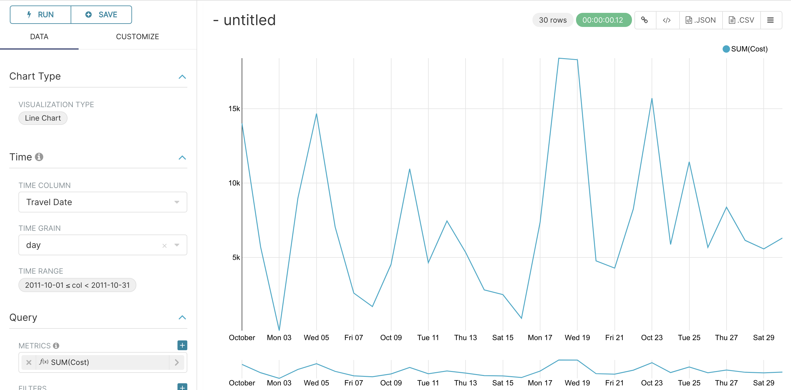
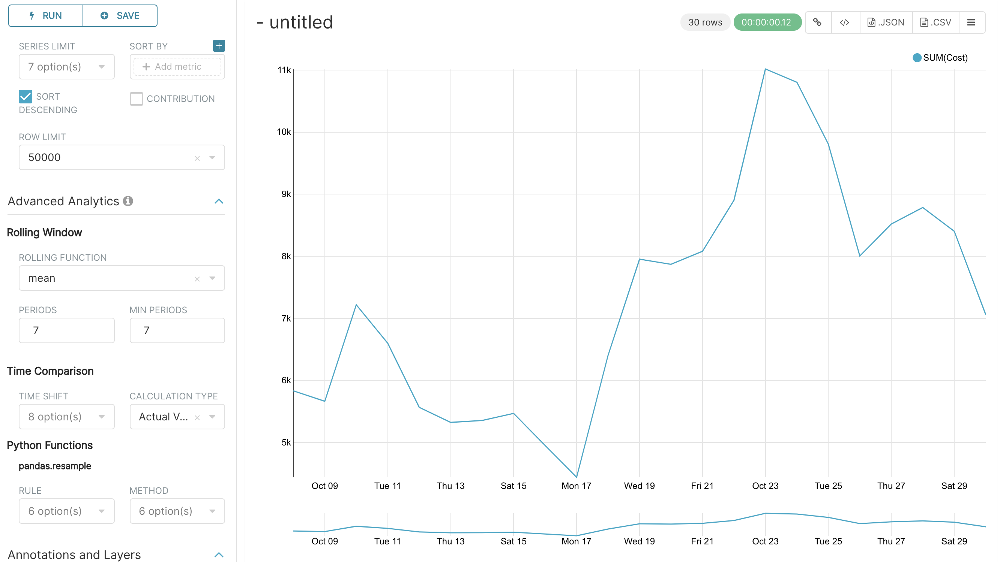
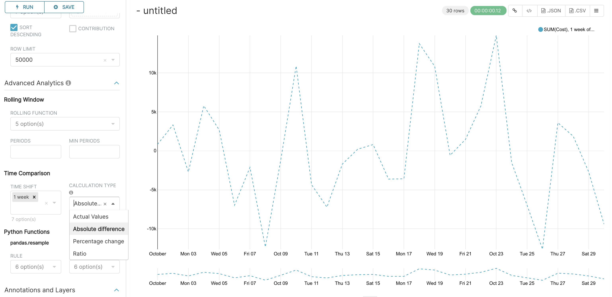
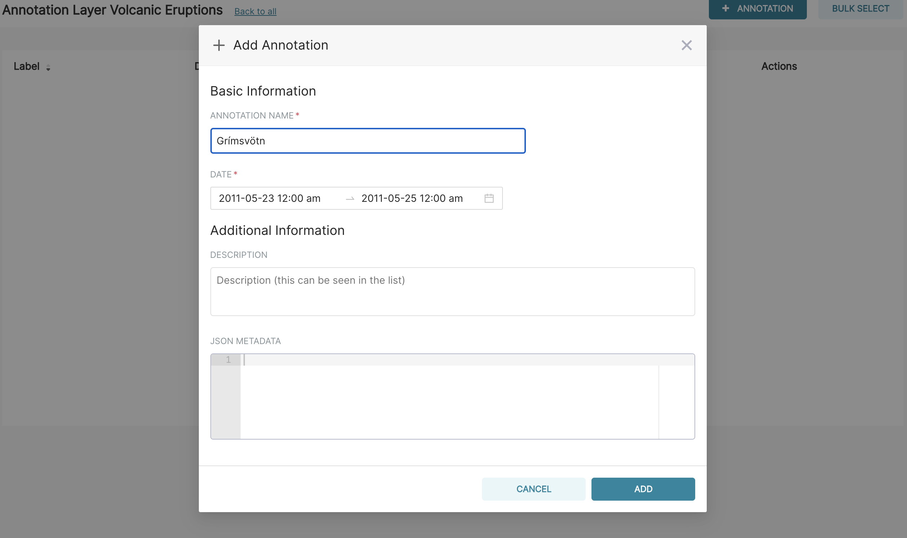
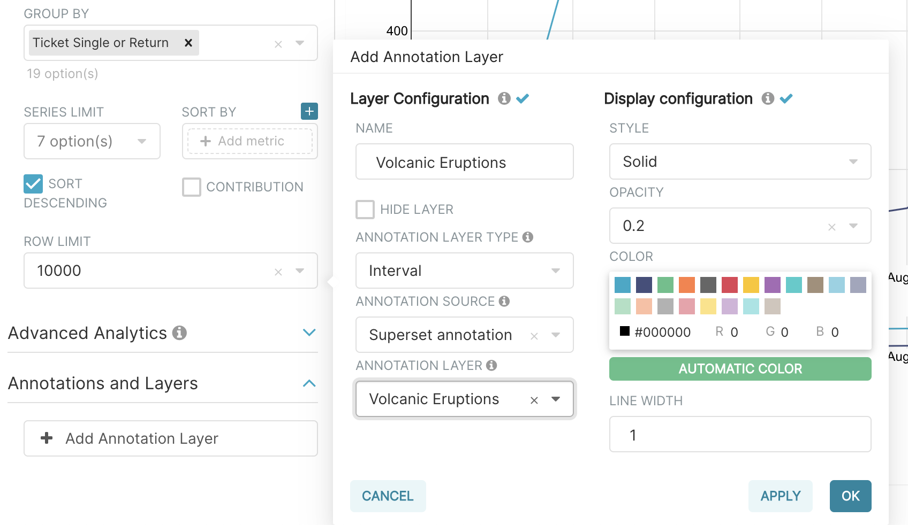
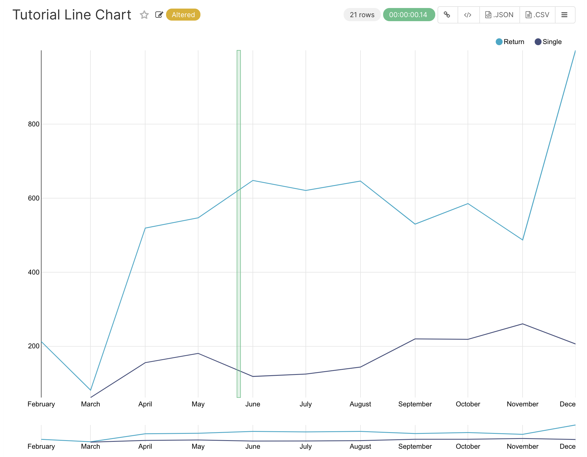

# บทที่ 7 — Advanced Analytics คำนวณเพิ่มจากผลลัพธ์

Advanced Analytics คือชุดเครื่องมือคำนวณที่ทำงานหลังจากฐานข้อมูลส่งผลลัพธ์กลับมาแล้ว ใช้ได้กับกราฟตระกูลอนุกรมเวลา เช่น Line Chart และ Area Chart จุดเด่นคือไม่ต้องเขียน SQL เพิ่มเลย

*รูปที่ 10 แผง Advanced Analytics และผลลัพธ์ของแต่ละหัวข้อ*

**① Rolling window** — เฉลี่ยเคลื่อนที่ ใช้ลดความแกว่งของข้อมูลเพื่อให้เห็นแนวโน้ม

**② Time comparison** — เทียบกับช่วงเวลาก่อนหน้า เช่น สัปดาห์ที่แล้วหรือปีที่แล้ว

**③ Python functions · Resample** — เปลี่ยนความถี่ของข้อมูล เช่น จากรายวันเป็นรายสัปดาห์

## 7.1 เตรียมกราฟตั้งต้น

1.  สร้างกราฟใหม่จาก + ‣ Chart เลือก tutorial_flights และชนิด Line Chart

2.  ตั้ง Time range แบบ Custom เป็นวันที่ 1 ตุลาคม 2011 ถึง 31 ตุลาคม 2011

3.  ตั้ง Time grain เป็น Day

4.  ที่ Metrics ให้ใช้ SUM(Cost)

5.  กด Create chart จะได้กราฟค่าใช้จ่ายรายวันที่ขึ้นลงแรงมาก

6.  กด Save ตั้งชื่อว่า Tutorial Advanced Analytics Base แล้วเพิ่มเข้า Tutorial Dashboard

> 📷 **ภาพหน้าจอจริงจากเอกสารทางการ (1 ภาพ)** — ที่มาและสัญญาอนุญาตอยู่ใน [`ATTRIBUTIONS.md`](../ATTRIBUTIONS.md)

*กราฟตั้งต้น: ค่าใช้จ่ายรายวัน ต.ค. 2011*

## 7.2 เฉลี่ยเคลื่อนที่ Rolling Mean

ข้อมูลรายวันแกว่งจนดูแนวโน้มไม่ออก วิธีแก้คือเฉลี่ยย้อนหลังหลายวันเข้าด้วยกัน

1.  กางหัวข้อ Advanced Analytics ในแท็บ Data

2.  ที่หัวข้อย่อย Rolling window ให้เลือก Rolling function เป็น mean

3.  ช่อง Periods พิมพ์ 7

4.  ช่อง Min periods พิมพ์ 7

5.  กด Create chart

Periods คือความยาวของหน้าต่างเฉลี่ย นับเป็นจำนวนเท่าของ Time grain ในที่นี้ Time grain เป็นวัน ค่า 7 จึงหมายถึงเฉลี่ย 7 วัน ส่วน Min periods ที่ตั้งเป็น 7 เช่นกัน เป็นการบังคับว่าต้องมีข้อมูลครบ 7 วันจริงจึงจะคำนวณ ทำให้ไม่มีค่าที่ผิดเพี้ยนช่วงต้นกราฟ ผลคือเส้นจะเรียบขึ้นและเริ่มช้ากว่าเดิม 6 วัน

บันทึกกราฟนี้ในชื่อ Tutorial Rolling Mean แล้วเพิ่มเข้า Tutorial Dashboard

> 📷 **ภาพหน้าจอจริงจากเอกสารทางการ (1 ภาพ)** — ที่มาและสัญญาอนุญาตอยู่ใน [`ATTRIBUTIONS.md`](../ATTRIBUTIONS.md)

*Moving Average แบบ mean 7 วัน*

## 7.3 เปรียบเทียบกับช่วงเวลาก่อนหน้า Time Comparison

1.  เปิดกราฟ Tutorial Advanced Analytics Base ขึ้นมาใหม่

2.  ที่หัวข้อย่อย Time comparison ช่อง Time shift ให้พิมพ์ว่า minus 1 week ช่องนี้รับภาษาอังกฤษแบบธรรมชาติ

3.  กด Create chart จะเห็นเส้นเพิ่มมาอีกหนึ่งเส้น เป็นค่าเดิมที่เลื่อนถอยหลังไปหนึ่งสัปดาห์

4.  เปลี่ยน Calculation type เป็น Absolute difference แล้วกด Create chart อีกครั้ง คราวนี้จะเหลือเส้นเดียว แสดงผลต่างระหว่างสองเส้นเดิม

5.  บันทึกในชื่อ Tutorial Time Comparison แล้วเพิ่มเข้า Tutorial Dashboard

| **Calculation type** | **ผลลัพธ์ที่ได้**                                   |
|:---------------------|:-----------------------------------------------|
| Values               | แสดงทั้งเส้นปัจจุบันและเส้นย้อนหลังคู่กัน                  |
| Absolute difference  | ผลต่างเป็นตัวเลขจริง เช่น มากกว่าสัปดาห์ก่อน 12,000 บาท |
| Percentage change    | ผลต่างเป็นร้อยละ เหมาะกับการรายงานผู้บริหาร           |
| Ratio                | อัตราส่วนระหว่างค่าปัจจุบันกับค่าย้อนหลัง                 |

> 📷 **ภาพหน้าจอจริงจากเอกสารทางการ (2 ภาพ)** — ที่มาและสัญญาอนุญาตอยู่ใน [`ATTRIBUTIONS.md`](../ATTRIBUTIONS.md)

*Time Shift `minus 1 week` แสดงสองเส้น*

*เปลี่ยนเป็น Absolute difference เหลือเส้นเดียว*

## 7.4 เปลี่ยนความถี่ข้อมูล Resample

1.  เปิดกราฟ Tutorial Advanced Analytics Base อีกครั้ง

2.  ที่หัวข้อย่อย Python functions ‣ Resample ช่อง Rule ให้พิมพ์ 7D ซึ่งหมายถึงทุก 7 วัน

3.  ช่อง Method ให้เลือก median

4.  กด Create chart จะเหลือจุดข้อมูลจุดเดียวต่อ 7 วัน โดยค่าที่แสดงคือค่ามัธยฐานของ 7 วันนั้น

5.  บันทึกในชื่อ Tutorial Resample แล้วเพิ่มเข้า Tutorial Dashboard

| **ค่า Rule** | **ความหมาย** |
|:------------|:-------------|
| 1D          | รายวัน        |
| 7D          | ทุก 7 วัน      |
| W           | รายสัปดาห์     |
| M           | รายเดือน      |
| Q           | รายไตรมาส    |
| A           | รายปี         |

> **ที่มาของค่าเหล่านี้**
> ช่อง Rule และ Method ส่งค่าต่อไปยังฟังก์ชัน resample ของไลบรารี pandas โดยตรง หากต้องการค่าอื่นที่ไม่อยู่ในตาราง สามารถดูรายการเต็มได้จากเอกสารของ pandas

> 📷 **ภาพหน้าจอจริงจากเอกสารทางการ (1 ภาพ)** — ที่มาและสัญญาอนุญาตอยู่ใน [`ATTRIBUTIONS.md`](../ATTRIBUTIONS.md)

*Resample `7D` ด้วย median*

## 7.5 เส้นเหตุการณ์บนกราฟ Annotations

บางครั้งกราฟกระโดดเพราะเหตุการณ์ภายนอก เช่น การประกาศนโยบายหรือภัยธรรมชาติ Superset ให้ทำเครื่องหมายเหตุการณ์นั้นลงบนกราฟได้ ตัวอย่างในเอกสารทางการใช้เหตุการณ์ภูเขาไฟ Grímsvötn ในไอซ์แลนด์ปะทุ ทำให้มีการยกเลิกเที่ยวบินระหว่างวันที่ 23–25 พฤษภาคม 2011

### ขั้นที่ 1 สร้างชั้นของเหตุการณ์

1.  ไปที่ Settings ‣ Manage ‣ Annotation Layers

2.  กดเครื่องหมายบวกเพื่อเพิ่มรายการใหม่

3.  ตั้งชื่อชั้นว่า Volcanic Eruptions แล้วบันทึก

### ขั้นที่ 2 เพิ่มเหตุการณ์เข้าไปในชั้น

1.  ไปที่ Settings ‣ Manage ‣ Annotations

2.  กดเครื่องหมายบวกเพื่อเพิ่มรายการใหม่

3.  เลือกชั้น Volcanic Eruptions

4.  ใส่คำอธิบายสั้น ๆ ว่า Grímsvötn

5.  กำหนดวันที่เริ่มและสิ้นสุดเป็น 23 ถึง 25 พฤษภาคม 2011 แล้วบันทึก

### ขั้นที่ 3 นำชั้นเหตุการณ์มาแสดงบนกราฟ

1.  เปิดกราฟ Tutorial Line Chart จากเมนู Charts

2.  หาหัวข้อ Annotations and Layers แล้วกด Add annotation layer

3.  ตั้งชื่อชั้นเป็น Volcanic Eruptions

4.  เปลี่ยน Annotation layer type เป็น Event

5.  ตั้ง Annotation source เป็น Superset annotation

6.  เลือก Annotation layer เป็น Volcanic Eruptions

7.  กด Apply เพื่อดูผล แล้วกด OK และ Save เพื่อบันทึกลงกราฟ

เมื่อบันทึกแล้ว เส้นเหตุการณ์จะปรากฏบนกราฟทุกที่ที่กราฟนี้ถูกนำไปวาง รวมถึงบน Tutorial Dashboard ด้วยโดยอัตโนมัติ

> 📷 **ภาพหน้าจอจริงจากเอกสารทางการ (3 ภาพ)** — ที่มาและสัญญาอนุญาตอยู่ใน [`ATTRIBUTIONS.md`](../ATTRIBUTIONS.md)

*สร้าง annotation (ตัวอย่างทางการ: ภูเขาไฟ Grímsvötn ปะทุ 23–25 พ.ค. 2011)*

*ตั้งค่า annotation layer บนกราฟ*

*ผลลัพธ์: เส้นเหตุการณ์ทับบนกราฟ*

---

[⟵ บทที่ 6 — สร้างกราฟแรกด้วยหน้า Explore](./06-สร้างกราฟแรก.md) · [สารบัญ](./README.md) · [บทที่ 8 — ประกอบแดชบอร์ดให้ใช้งานได้จริง ⟶](./08-ประกอบแดชบอร์ด.md)
