# บทที่ 8 — ประกอบแดชบอร์ดให้ใช้งานได้จริง

ถึงตอนนี้คุณมีกราฟหลายรูปแล้ว บทนี้จะพาจัดวางให้เป็นหน้าเดียวที่อ่านง่าย ใส่ตัวกรอง และเผยแพร่ให้คนอื่นดู

## 8.1 เข้าโหมดแก้ไข และจัดวางกราฟ

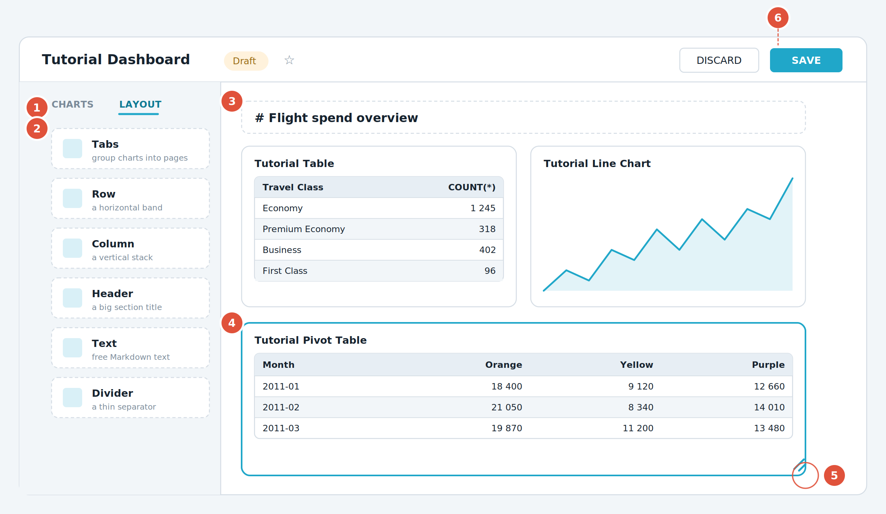

*รูปที่ 11 แดชบอร์ดในโหมดแก้ไข พร้อมแผงองค์ประกอบทางซ้าย*

**① แท็บ Charts** — รายการกราฟทั้งหมดที่มีอยู่ ลากจากตรงนี้มาวางบนพื้นที่ทำงานได้เลย

**② แท็บ Layout** — องค์ประกอบจัดหน้า ได้แก่ Tabs, Row, Column, Header, Text และ Divider

**③ หัวข้อ Header** — ใช้คั่นเป็นหมวดหมู่ให้แดชบอร์ดอ่านง่าย

**④ กราฟที่กำลังเลือก** — คลิกที่กราฟจะมีกรอบสีฟ้าขึ้น แสดงว่ากำลังแก้ไขชิ้นนี้

**⑤ มุมขวาล่างของกราฟ** — ลากมุมนี้เพื่อย่อขยายขนาด ระบบจะจัดให้ลงล็อกตารางอัตโนมัติ

**⑥ ปุ่ม Save และ Discard** — Save คือบันทึกการจัดหน้า ส่วน Discard คือทิ้งการแก้ไขทั้งหมด

1.  เปิด Tutorial Dashboard จากเมนู Dashboards

2.  กดปุ่ม Edit dashboard มุมขวาบน

3.  ชี้เมาส์ที่กราฟ แล้วลากมุมขวาล่างเพื่อปรับขนาดจนพอใจ

4.  ลากกราฟทั้งชิ้นเพื่อย้ายตำแหน่ง สังเกตเส้นสีฟ้าที่ขึ้นมาบอกว่าจะไปวางตรงไหน

5.  กด Save เพื่อบันทึก

> 📷 **ภาพหน้าจอจริงจากเอกสารทางการ (4 ภาพ)** — ที่มาและสัญญาอนุญาตอยู่ใน [`ATTRIBUTIONS.md`](../ATTRIBUTIONS.md)

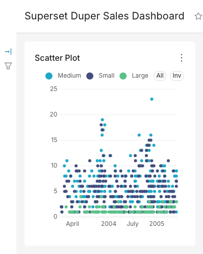

*แดชบอร์ดแรกหลังบันทึกกราฟเข้าไป*


*ปุ่ม **Edit Dashboard***

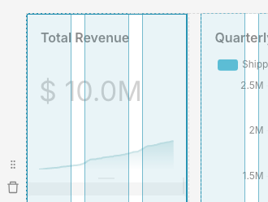

*ลากมุมขวาล่างเพื่อปรับขนาด*

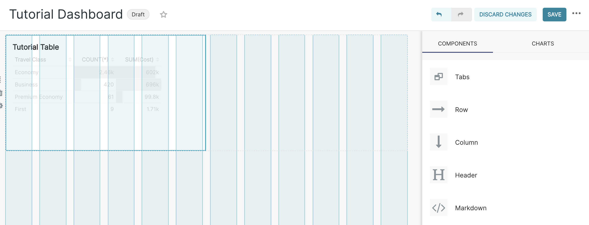

*ปรับขนาดตารางบนแดชบอร์ด*

## 8.2 ใส่ข้อความอธิบายด้วย Markdown

แดชบอร์ดที่ดีควรมีคำอธิบายว่าใครควรดู ดูอะไร และข้อมูลอัปเดตเมื่อไร

1.  อยู่ในโหมด Edit dashboard

2.  แถบขวามีสองแท็บ **CHARTS** กับ **LAYOUT ELEMENTS** — กล่อง Markdown อยู่ใต้ **LAYOUT ELEMENTS** ไม่ใช่แท็บที่เปิดอยู่ตอนแรก กดสลับไปแท็บนั้นก่อน แล้วลาก **Markdown** มาวางบนแดชบอร์ด สังเกตเส้นสีฟ้าที่บอกตำแหน่งวาง

3.  คลิกที่กล่องเพื่อพิมพ์ข้อความ โดยใช้รูปแบบ Markdown

4.  สลับดูผลลัพธ์ได้ด้วยเมนู Edit และ Preview ที่ด้านบนของกล่อง

5.  คลิกที่พื้นที่อื่นเพื่อออกจากกล่อง แล้วกด Save

```bash
## แดชบอร์ดค่าใช้จ่ายการเดินทาง
**ผู้รับผิดชอบ:** ฝ่ายการเงิน
**รอบข้อมูล:** ปรับปรุงทุกวันเวลา 06:00 น.
- ตัวเลขทั้งหมดเป็นสกุลเงินบาท
- ตั๋วไป-กลับนับเป็นหนึ่งรายการ
```

> 📷 **ภาพหน้าจอจริงจากเอกสารทางการ (2 ภาพ)** — ที่มาและสัญญาอนุญาตอยู่ใน [`ATTRIBUTIONS.md`](../ATTRIBUTIONS.md)

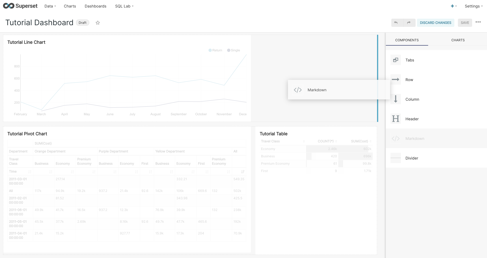

*เส้นน้ำเงินบอกตำแหน่งที่จะวางองค์ประกอบ*

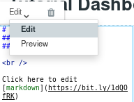

*กล่อง Markdown สลับโหมด Edit/Preview*

## 8.2.1 บันทึกประจำสัปดาห์ — กติกาเฉพาะของวิชานี้

หัวข้อนี้ไม่ใช่ความสามารถของ Superset แต่เป็นกติกาของ CSI414 ที่ใช้กล่อง Markdown
ในหัวข้อ 8.2 เป็นที่เขียน จึงเขียนไว้ตรงนี้ให้ค้นเจอที่เดียวกัน

**คุณต้องมีกล่อง Markdown หนึ่งกล่องบนแดชบอร์ด `csi414_<รหัสนักศึกษา>` ตั้งแต่สัปดาห์แรก**
แล้วเขียนต่อท้ายลงไปทุกสัปดาห์ โดยคั่นแต่ละสัปดาห์ด้วยหัวข้อระดับสอง

```markdown
## บันทึกสัปดาห์ที่ 1

เข้าใช้งานได้แล้ว ดูเมนู Charts กับ Dashboards ที่อาจารย์พาทัวร์
สิ่งที่ยังไม่เข้าใจคือ Dataset ต่างจาก Database ตรงไหน

## บันทึกสัปดาห์ที่ 2

(เนื้อความของสัปดาห์ที่ 2 เขียนต่อลงมาตรงนี้ ไม่ทับของสัปดาห์ที่ 1)
```

> ตัวอย่างข้างบนจงใจไม่เขียนเนื้อความของสัปดาห์ที่ 2 ให้ครบ
> เพราะบันทึกที่ดีต้องมาจากตัวเลขบนแดชบอร์ดของคุณเอง
> ซึ่งไม่มีทางเหมือนของคนอื่นถ้าคุณเปิดดูงานตัวเองจริง ๆ

**หัวข้อต้องพิมพ์ให้ตรงตัวอักษร** — สองชาร์ป เว้นวรรคหนึ่งครั้ง แล้ว `บันทึกสัปดาห์ที่ N`
ระบบตรวจอ่านจากหัวข้อนี้เพื่อหาว่าบันทึกของสัปดาห์ไหนอยู่ตรงไหน
`###` สามชาร์ป · `##บันทึก` ไม่เว้นวรรค · `## บันทึกสัปดาห์ 2` ที่ตก "ที่" — สามแบบนี้ระบบหาไม่เจอ
และเนื้อความต้องอยู่ **ใต้** หัวข้อ ไปจนถึงหัวข้อถัดไป

### ห้ามลบบันทึกของสัปดาห์ก่อน

ระบบตรวจสะสม ทุกสัปดาห์จะตรวจย้อนกลับไปถึงสัปดาห์ที่ 1 ด้วยเสมอ
ลบบันทึกเก่าทิ้งจึงทำให้คะแนนของสัปดาห์เก่าหายไปด้วย เหมือนกับการลบกราฟเก่าทิ้ง
เขียนต่อท้ายเสมอ ไม่ต้องเขียนทับ

### เขียนอย่างไรจึงได้เต็ม

คะแนนส่วนนี้ 2 คะแนนจาก 10 ตัดสินด้วยกฎ ไม่มีคนอ่านและไม่มีโมเดลภาษา

| ได้ | เมื่อ |
|---|---|
| 2 | เนื้อความยาวตั้งแต่ 100 ตัวอักษร ไม่ซ้ำสัปดาห์ก่อน และ (ตั้งแต่สัปดาห์ที่ 2) มีตัวเลขหรือชื่อค่าจากชุดข้อมูลอ้างอิงอยู่ |
| 1 | ยาว 60–99 ตัวอักษร หรือลอกของสัปดาห์ก่อนมาทั้งดุ้น หรือยังไม่มีร่องรอยว่าดูข้อมูลจริง |
| 0 | ไม่มีบันทึกของสัปดาห์นั้น ยาวไม่ถึง 60 ตัวอักษร หรือยังเป็นข้อความแม่แบบที่แจกไป |

กฎข้อที่สำคัญที่สุดคือข้อสุดท้ายของเกณฑ์ 2 คะแนน — **เขียนสิ่งที่เห็น ไม่ใช่สิ่งที่ทำ**

> ❌ "ทำตารางไขว้เสร็จแล้ว ใส่ลงแดชบอร์ดเรียบร้อย"
> ✅ "แผนก Orange ใช้เงินมากกว่า Yellow ทั้งที่เดินทางน้อยกว่า 366 ครั้ง"

ประโยคแรกเล่าขั้นตอน ซึ่งไม่มีตัวเลขเพราะขั้นตอนไม่มีตัวเลข
ประโยคหลังเล่าสิ่งที่เห็นบนจอ จึงมีตัวเลขติดมาเองโดยธรรมชาติ
ระบบใช้ความต่างข้อนี้แหละเป็นตัวแยก และเหตุผลที่ได้หรือไม่ได้จะพิมพ์กลับมาในรายงานผลตรวจเสมอ

## 8.3 ตัวกรองระดับแดชบอร์ด Native Filters

ตัวกรองระดับแดชบอร์ดคือแถบด้านซ้ายที่ให้ผู้ใช้เลือกเงื่อนไขครั้งเดียว แล้วกราฟทุกรูปในหน้าเปลี่ยนตามพร้อมกัน

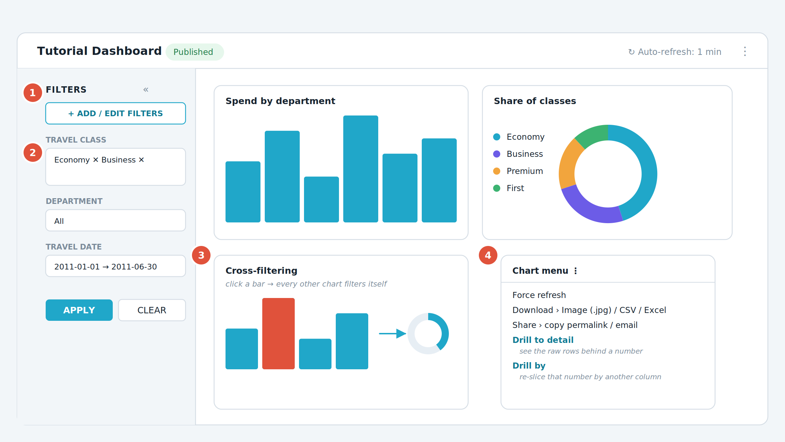

*รูปที่ 12 แถบตัวกรอง การกรองข้ามกราฟ และเมนูของกราฟแต่ละรูป*

**① แถบ Filters** — อยู่ด้านซ้าย ย่อเก็บได้ด้วยเครื่องหมายลูกศร

**② ตัวกรองหนึ่งตัว** — เลือกค่าได้หลายค่าพร้อมกัน แล้วกด Apply

**③ Cross-filtering** — คลิกที่แท่งหรือชิ้นส่วนของกราฟใดก็ได้ กราฟอื่นในหน้าจะกรองตามทันที

**④ เมนูของกราฟ** — เข้าถึงได้ที่จุดสามจุดมุมขวาบนของกราฟ รวมคำสั่งดาวน์โหลด แชร์ และเจาะลึกข้อมูล

### วิธีเพิ่มตัวกรอง

1.  เปิดแดชบอร์ด กดจุดสามจุดมุมขวาบน แล้วเลือก Edit dashboard

2.  เปิดแถบ Filters ทางซ้าย แล้วกด + Add/Edit Filters

3.  เลือกชนิดตัวกรอง เช่น Value สำหรับเลือกจากรายการค่า หรือ Time range สำหรับช่วงเวลา

4.  ตั้งชื่อที่ผู้ใช้จะเห็น เช่น ชั้นโดยสาร

5.  เลือก Dataset และ Column ที่ต้องการกรอง เช่น tutorial_flights และ Travel Class

6.  กำหนดค่าเริ่มต้นและขอบเขตการมีผล (Scope) ว่าจะให้กระทบกราฟทุกรูปหรือเฉพาะบางรูป

7.  กด Save

| **ชนิดตัวกรอง**            | **ใช้เมื่อ**                                        |
|:-------------------------|:-------------------------------------------------|
| Value                    | ให้ผู้ใช้เลือกจากรายการค่าที่มีอยู่ เช่น ชื่อจังหวัด ชื่อฝ่าย       |
| Numerical range          | กรองช่วงตัวเลข เช่น ราคาตั้งแต่เท่าไรถึงเท่าไร            |
| Time range               | เลือกช่วงเวลา รองรับการพิมพ์เป็นภาษาอังกฤษแบบธรรมชาติ    |
| Time column / Time grain | ให้ผู้ใช้เปลี่ยนคอลัมน์เวลาหรือระดับความละเอียดของเวลาเองได้ |
| Group By                 | ให้ผู้ใช้เลือกเองว่าจะจัดกลุ่มด้วยคอลัมน์ไหน                 |

> **ตัวกรองบน Semantic view**
> หากผู้ดูแลระบบเปิดฟีเจอร์ทดลอง SEMANTIC_LAYERS ไว้ Superset จะเชื่อมต่อกับ Semantic layer ภายนอกอย่าง dbt Semantic Layer หรือ Cube ได้ และ semantic view เหล่านั้นจะปรากฏให้เลือกเป็นแหล่งข้อมูลของตัวกรองเช่นเดียวกับ Dataset ปกติ กราฟทุกรูปที่ใช้ semantic view เดียวกันจะถูกกรองพร้อมกัน

> 📷 **ภาพหน้าจอจริงจากเอกสารทางการ (2 ภาพ)** — ที่มาและสัญญาอนุญาตอยู่ใน [`ATTRIBUTIONS.md`](../ATTRIBUTIONS.md)

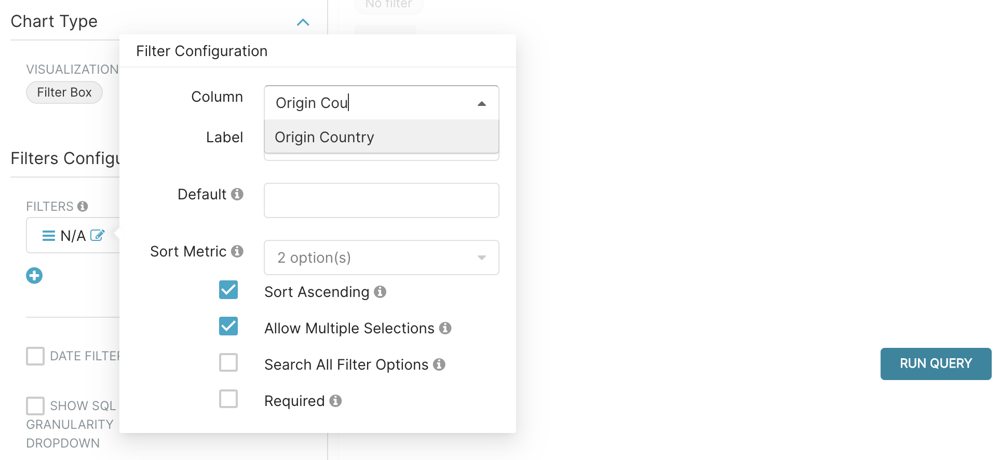

*Native Filter กรองตามประเทศต้นทาง*

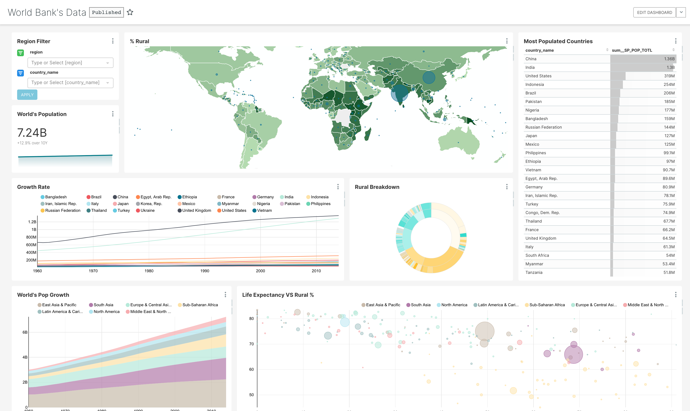

*ภาพรวมแดชบอร์ดที่เสร็จแล้ว*

## 8.4 การเจาะลึกข้อมูล

| **คำสั่ง** | **ทำอะไร** | **เข้าถึงอย่างไร** |
|:---|:---|:---|
| Drill to detail | แสดงข้อมูลระดับแถวที่อยู่เบื้องหลังตัวเลขนั้น | คลิกขวาที่จุดข้อมูล หรือเลือกจากเมนูจุดสามจุด |
| Drill by | หั่นตัวเลขเดิมด้วยคอลัมน์อื่นทันที โดยไม่ต้องแก้กราฟ | คลิกขวาที่จุดข้อมูล แล้วเลือกคอลัมน์ที่ต้องการ |
| Cross-filter | ใช้ค่าที่คลิกไปกรองกราฟอื่นทั้งหน้า | คลิกที่แท่งหรือชิ้นส่วนของกราฟโดยตรง |
| View query | ดูคำสั่ง SQL จริงที่ Superset ส่งไปยังฐานข้อมูล | เมนูจุดสามจุดของกราฟ |

ในหน้าต่าง Drill to detail และ Drill by มีปุ่ม Download ให้ส่งออกผลลัพธ์เป็น CSV หรือ Excel ได้ โดยส่งออกทั้งชุดผลลัพธ์ ไม่ได้จำกัดเฉพาะหน้าที่เห็นอยู่

## 8.5 ตั้งค่าที่ควรเปิดให้ผู้ใช้

| **ค่าที่ตั้งได้** | **วิธีตั้ง** | **หมายเหตุ** |
|:---|:---|:---|
| รีเฟรชอัตโนมัติ | เมนูจุดสามจุด ‣ Set auto-refresh interval | ค่านี้มีผลเฉพาะรอบการใช้งานนั้น ปิดแท็บแล้วจะกลับเป็นค่าเดิม |
| แสดงเวลาที่ดึงข้อมูลล่าสุด | Dashboard Properties ‣ Styling ‣ Show last queried time | มีประโยชน์มากเมื่อเปิดรีเฟรชอัตโนมัติ เพื่อยืนยันความสดของข้อมูล |
| แท็บภายในแดชบอร์ด | ลากองค์ประกอบ Tabs มาวางในโหมดแก้ไข | แต่ละแท็บมี URL ของตัวเอง คัดลอกจากช่องที่อยู่เพื่อแชร์ให้เปิดตรงแท็บนั้น |
| บันทึกกราฟลงแท็บที่ต้องการ | ตอนกด Save จากหน้า Explore เลือกแท็บจากรายการต้นไม้ในหน้าต่าง Add to dashboard | ช่วยไม่ให้กราฟไปตกอยู่แท็บแรกเสมอ |

> **ระวังเรื่องรีเฟรชอัตโนมัติ**
> การรีเฟรชจะสั่งโหลดข้อมูลใหม่ทุกกราฟบนแดชบอร์ดพร้อมกัน หากคิวรีหนัก การตั้งช่วงเวลาสั้นเกินไปจะทำให้ฐานข้อมูลรับภาระหนักมาก แนะนำให้ตั้งไม่ต่ำกว่า 1 นาทีสำหรับแดชบอร์ดทั่วไป

> 📷 **ภาพหน้าจอจริงจากเอกสารทางการ (1 ภาพ)** — ที่มาและสัญญาอนุญาตอยู่ใน [`ATTRIBUTIONS.md`](../ATTRIBUTIONS.md)

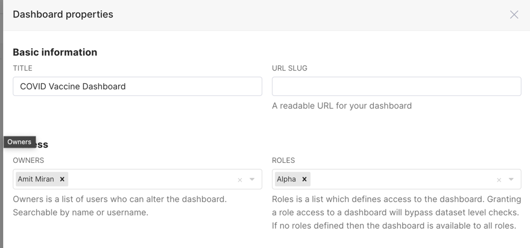

*การให้สิทธิ์เข้าถึงแดชบอร์ด*

## 8.6 เผยแพร่แดชบอร์ด

แดชบอร์ดที่สร้างใหม่จะอยู่ในสถานะ Draft ซึ่งเห็นได้เฉพาะผู้แก้ไขและผู้ดูแลระบบเท่านั้น

1.  เปิดแดชบอร์ดที่ต้องการเผยแพร่

2.  คลิกที่คำว่า Draft ซึ่งอยู่ข้างชื่อแดชบอร์ดด้านบนซ้าย

3.  สถานะจะเปลี่ยนเป็น Published ทันที

4.  คลิกไอคอนดาวข้างชื่อ เพื่อปักหมุดไว้ในรายการโปรดของคุณ

เมื่อเผยแพร่แล้ว ผู้ที่มีสิทธิ์เข้าถึง Dataset ที่ใช้ในแดชบอร์ดจะมองเห็นได้ หรือหากผู้ดูแลระบบเปิดค่า ENABLE_VIEWERS ไว้ ก็จะมองเห็นได้ผ่านสิทธิ์ผู้ชมที่กำหนดให้โดยตรงหรือผ่านบทบาทและกลุ่ม

> 📷 **ภาพหน้าจอจริงจากเอกสารทางการ (2 ภาพ)** — ที่มาและสัญญาอนุญาตอยู่ใน [`ATTRIBUTIONS.md`](../ATTRIBUTIONS.md)

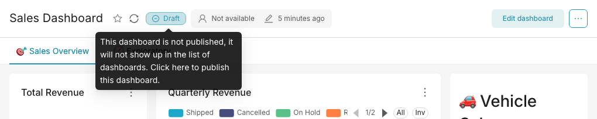

*ปุ่มสลับ Draft ↔ Published*

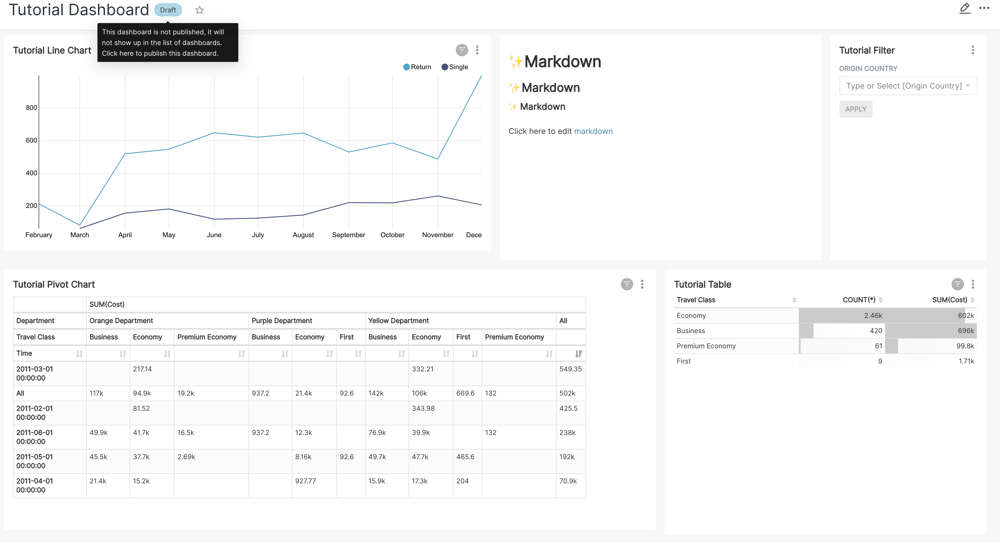

*แดชบอร์ดที่เผยแพร่แล้ว*

## 8.7 ปรับหน้าตาแดชบอร์ดด้วยพารามิเตอร์ใน URL

มีประโยชน์มากเมื่อต้องนำแดชบอร์ดไปฉายขึ้นจอในห้องประชุม หรือฝังลงเว็บไซต์อื่น

| **พารามิเตอร์**  | **ค่า**  | **ผลลัพธ์**                           |
|:---------------|:--------|:------------------------------------|
| standalone     | 0       | แสดงตามปกติ เป็นค่าเริ่มต้น               |
| standalone     | 1       | ซ่อนแถบเมนูด้านบน                      |
| standalone     | 2       | ซ่อนแถบเมนูและชื่อแดชบอร์ด               |
| standalone     | 3       | ซ่อนแถบเมนู ชื่อ และแท็บระดับบนสุด         |
| show_filters   | 0       | ไม่แสดงแถบตัวกรอง                     |
| show_filters   | 1       | แสดงแถบตัวกรอง เป็นค่าเริ่มต้น            |
| expand_filters | 0 หรือ 1 | กำหนดว่าแถบตัวกรองจะย่อหรือกางไว้ตั้งแต่แรก |

```bash
# ตัวอย่าง ซ่อนเมนูด้านบนและซ่อนแถบตัวกรอง เหมาะกับการฉายขึ้นจอ
http://localhost:8088/superset/dashboard/my-dashboard/?standalone=1&amp;show_filters=0
```

## 8.8 ส่งออกข้อมูลจากแดชบอร์ด

- ดาวน์โหลดกราฟเป็นภาพ เมนูจุดสามจุดของกราฟ ‣ Download ‣ Image (.jpg)

- ดาวน์โหลดข้อมูลเป็น CSV หรือ Excel เมนูจุดสามจุดของกราฟ ‣ Download ‣ Export to original .CSV หรือ .XLSX

- หากกราฟตารางเปิดช่องค้นหาไว้และมีการพิมพ์ค้นหาอยู่ ปุ่ม Download จะส่งออกเฉพาะแถวที่เห็นหลังกรองเท่านั้น ซึ่งเป็นพฤติกรรมที่ตั้งใจให้ตรงกับสิ่งที่แสดงบนจอ หากต้องการทั้งชุด ให้ล้างคำค้นก่อน แล้วจึงสั่ง Download as CSV

---

[⟵ บทที่ 7 — Advanced Analytics คำนวณเพิ่มจากผลลัพธ์](./07-advanced-analytics.md) · [สารบัญ](./README.md) · [บทที่ 9 — SQL Lab เมื่ออยากคุมคำสั่งเอง ⟶](./09-sql-lab.md)
