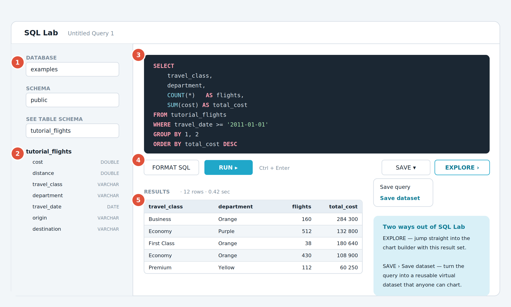

# บทที่ 9 — SQL Lab เมื่ออยากคุมคำสั่งเอง

หน้า Explore ครอบคลุมงานส่วนใหญ่ได้ แต่เมื่อต้องรวมหลายตาราง คำนวณซับซ้อน หรืออยากตรวจข้อมูลเร็ว ๆ SQL Lab คือคำตอบ



*รูปที่ 13 หน้าจอ SQL Lab และเส้นทางออกไปสร้างกราฟ*

**① เลือกฐานข้อมูลและ Schema** — ต้องเลือกให้ครบก่อนเขียนคำสั่ง

**② ตัวสำรวจตาราง** — คลิกที่ Schema เพื่อกางรายการตาราง แล้วคลิกที่ตารางเพื่อดูคอลัมน์และข้อมูลตัวอย่าง

**③ ช่องเขียน SQL** — รองรับการเติมคำอัตโนมัติ กด Ctrl + F หรือ Cmd + F เพื่อค้นหาและแทนที่ในตัวแก้ไข

**④ ปุ่ม Run** — หรือใช้แป้นลัด Ctrl + Enter ปุ่ม Format SQL จะจัดรูปแบบตามภาษาถิ่นของฐานข้อมูลที่เลือกอยู่

**⑤ ผลลัพธ์** — แสดงจำนวนแถวและเวลาที่ใช้ กดปุ่ม Explore เพื่อไปสร้างกราฟ หรือ Save ‣ Save dataset เพื่อเก็บเป็นชุดข้อมูลถาวร

## 9.1 ลองเขียนคำสั่งแรก

1.  ไปที่เมนู SQL ‣ SQL Lab

2.  เลือก Database เป็น examples และ Schema เป็น public

3.  พิมพ์คำสั่งด้านล่างลงในช่องเขียน SQL

4.  กด Run หรือ Ctrl + Enter

5.  ดูผลลัพธ์ในตารางด้านล่าง

```bash
SELECT
travel_class,
department,
COUNT(*) AS flights,
SUM(cost) AS total_cost
FROM tutorial_flights
WHERE travel_date &gt;= '2011-01-01'
GROUP BY 1, 2
ORDER BY total_cost DESC
```

## 9.2 ทางออกสองทางจาก SQL Lab

| **ปุ่ม** | **ผลที่ได้** | **เหมาะกับ** |
|:---|:---|:---|
| **Explore** | พาไปหน้าสร้างกราฟทันทีโดยใช้ผลลัพธ์ชุดนี้ | ดูผลครั้งเดียว ไม่ต้องเก็บถาวร |
| **Save ‣ Save dataset** | เปลี่ยนคำสั่งนี้เป็น Virtual dataset ที่ทุกคนนำไปสร้างกราฟต่อได้ | คำสั่งที่จะใช้ซ้ำ และอยากให้ทีมใช้สูตรเดียวกัน |
| **Save ‣ Save query** | เก็บคำสั่งไว้เฉย ๆ เพื่อกลับมาเปิดใหม่ | งานที่ยังทำไม่เสร็จ หรือคำสั่งที่ใช้ตรวจสอบเป็นครั้งคราว |

## 9.3 เคล็ดลับการใช้ SQL Lab

- ตัวสำรวจตารางด้านซ้ายเป็นแบบต้นไม้ที่กางเก็บได้ คลิก Schema เพื่อกางตาราง แล้วคลิกตารางเพื่อดูคอลัมน์และข้อมูลตัวอย่างในที่เดียว เร็วกว่าการเลื่อนหารายการยาว ๆ มาก

- กด Ctrl + F หรือ Cmd + F เพื่อเปิดกล่องค้นหาและแทนที่ภายในตัวแก้ไข โดยไม่ต้องออกจากช่องเขียน SQL

- เส้นแบ่งระหว่างช่องเขียน SQL ตัวสำรวจตาราง และช่องผลลัพธ์ ลากปรับขนาดได้ทั้งหมด

- ปุ่ม Format SQL จัดรูปแบบตามภาษาถิ่นของฐานข้อมูลที่เลือกอยู่จริง ทั้ง Trino, Presto, MySQL และ PostgreSQL หากสลับฐานข้อมูลแล้วสั่งจัดรูปแบบใหม่ จะได้ผลตามภาษาถิ่นนั้น และไวยากรณ์ Jinja จะถูกรักษาไว้ไม่ทำให้เกิดข้อผิดพลาด

- ดูประวัติคำสั่งที่เคยรันได้ที่ SQL ‣ Query history

## 9.4 Jinja Templating เบื้องต้น

Superset ให้แทรกตัวแปรลงใน SQL ได้ด้วยไวยากรณ์ Jinja ทำให้คำสั่งเดียวยืดหยุ่นตามบริบท ต้องให้ผู้ดูแลระบบเปิดค่า ENABLE_TEMPLATE_PROCESSING ก่อนจึงจะใช้ได้

```bash
-- ใช้ช่วงเวลาที่ผู้ใช้เลือกบนแดชบอร์ด
SELECT department, SUM(cost) AS total
FROM tutorial_flights
WHERE travel_date &gt;= '{{ from_dttm }}'
AND travel_date &lt; '{{ to_dttm }}'
GROUP BY department
-- ใช้ค่าจากตัวกรองของแดชบอร์ด
WHERE travel_class IN {{ filter_values('travel_class') | where_in }}
-- ใช้ชื่อผู้ใช้ที่กำลังล็อกอิน เพื่อจำกัดข้อมูลรายบุคคล
WHERE owner_username = '{{ current_username() }}'
```

| **ตัวแปร**                  | **ให้ค่าอะไร**                  |
|:---------------------------|:------------------------------|
| {{ from_dttm }}            | วันเวลาเริ่มต้นของช่วงเวลาที่ผู้ใช้เลือก |
| {{ to_dttm }}              | วันเวลาสิ้นสุดของช่วงเวลาที่ผู้ใช้เลือก  |
| {{ current_username() }}   | ชื่อผู้ใช้ที่กำลังเข้าระบบอยู่           |
| {{ filter_values('col') }} | ค่าที่ผู้ใช้เลือกในตัวกรองของคอลัมน์นั้น  |

## 9.5 การเขียนช่วงเวลาเป็นภาษาอังกฤษแบบธรรมชาติ

ช่อง Time range แบบ Custom รับข้อความภาษาอังกฤษได้ นอกเหนือจากการระบุวันที่ตรง ๆ ข้อดีคือกราฟที่บันทึกไว้จะเลื่อนตามวันปัจจุบันเสมอ เพราะระบบประเมินค่าตอนรันคิวรี

| **ประเภท** | **ตัวอย่างข้อความที่พิมพ์ได้** |
|:---|:---|
| ย้อนหลังแบบสัมพัทธ์ | Last 7 days, Last month, Last quarter, Last year |
| อ้างอิงปฏิทิน | previous calendar week, previous calendar month |
| นับจากวันแรกของช่วง | first day of this week, first day of this month, first day of this quarter, first day of this year, first week of this year |
| เลื่อนไปข้างหน้าหรือถอยหลัง | 30 days ago, 1 year ago, next week |

---

[⟵ บทที่ 8 — ประกอบแดชบอร์ดให้ใช้งานได้จริง](./08-ประกอบแดชบอร์ด.md) · [สารบัญ](./README.md) · [บทที่ 10 — ผู้ใช้ สิทธิ์ และการส่งต่องาน ⟶](./10-ผู้ใช้-สิทธิ์-ส่งต่องาน.md)
