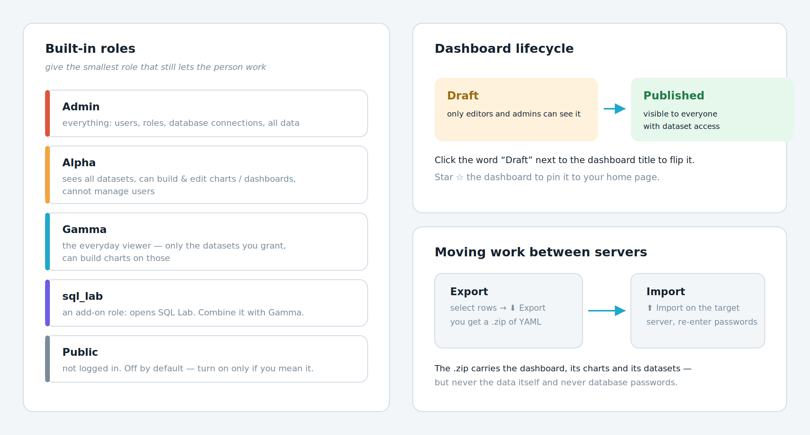

# บทที่ 10 — ผู้ใช้ สิทธิ์ และการส่งต่องาน

เมื่อแดชบอร์ดเริ่มมีคนใช้จริง คำถามถัดมาคือใครควรเห็นอะไร และจะย้ายงานที่ทำไว้ไปยังเซิร์ฟเวอร์จริงอย่างไร

*รูปที่ 14 บทบาทผู้ใช้ในตัว วงจรสถานะแดชบอร์ด และการย้ายงานข้ามเซิร์ฟเวอร์*

## 10.1 บทบาทผู้ใช้ที่มีมาให้ในตัว

| **บทบาท** | **ทำอะไรได้** | **เหมาะกับใคร** |
|:---|:---|:---|
| **Admin** | ทำได้ทุกอย่าง รวมถึงจัดการผู้ใช้ สิทธิ์ และการเชื่อมต่อฐานข้อมูล | ผู้ดูแลระบบ ควรมีน้อยคนที่สุด |
| **Alpha** | เห็น Dataset ทั้งหมด สร้างและแก้ไขกราฟกับแดชบอร์ดได้ แต่จัดการผู้ใช้ไม่ได้ | นักวิเคราะห์ข้อมูลที่ต้องสร้างงานเอง |
| **Gamma** | เห็นเฉพาะ Dataset ที่ได้รับสิทธิ์ และสร้างกราฟจาก Dataset เหล่านั้นได้ | ผู้ใช้ทั่วไปในองค์กร เป็นบทบาทที่ควรให้เป็นค่าเริ่มต้น |
| **sql_lab** | เปิดใช้ SQL Lab ได้ เป็นบทบาทเสริม ต้องใช้คู่กับ Gamma หรือ Alpha | คนที่เขียน SQL เป็นและจำเป็นต้องใช้ |
| **Public** | ผู้ที่ยังไม่ได้เข้าสู่ระบบ ปิดไว้เป็นค่าเริ่มต้น | เปิดเฉพาะกรณีที่ตั้งใจให้ข้อมูลเป็นสาธารณะจริง ๆ |

> **หลักการให้สิทธิ์**
> ให้บทบาทที่เล็กที่สุดที่ยังทำงานได้เสมอ คนส่วนใหญ่ควรได้ Gamma บวกกับสิทธิ์เข้าถึง Dataset เฉพาะที่จำเป็น การให้ Alpha กับทุกคนหมายความว่าทุกคนเห็นข้อมูลทุกชุดในระบบ ซึ่งมักไม่ใช่สิ่งที่ตั้งใจ

## 10.2 เพิ่มผู้ใช้ใหม่

1.  ไปที่ Settings ‣ Manage ‣ List Users

2.  กดเครื่องหมายบวกเพื่อเพิ่มผู้ใช้

3.  กรอกชื่อ นามสกุล ชื่อผู้ใช้ อีเมล และรหัสผ่าน

4.  ที่ช่อง Role ให้เลือกบทบาท เช่น Gamma และเลือก sql_lab เพิ่มหากจำเป็น

5.  กด Save

หากองค์กรใช้ระบบล็อกอินกลางอยู่แล้ว เช่น LDAP, OAuth หรือ SAML ผู้ดูแลระบบสามารถตั้งค่าให้ Superset เชื่อมกับระบบเหล่านั้น และกำหนดบทบาทเริ่มต้นให้ผู้ใช้ใหม่โดยอัตโนมัติได้ ดูรายละเอียดในหน้า Security ของเอกสารทางการ

## 10.3 ควบคุมว่าใครเห็นแดชบอร์ดใดได้บ้าง

- สถานะ Draft เห็นเฉพาะผู้แก้ไขและผู้ดูแลระบบ

- สถานะ Published ผู้ที่มีสิทธิ์เข้าถึง Dataset ที่แดชบอร์ดใช้อยู่จะมองเห็นได้

- หากผู้ดูแลระบบเปิดค่า ENABLE_VIEWERS จะกำหนดผู้ชมให้แดชบอร์ดโดยตรง หรือผ่านบทบาทและกลุ่มที่กำหนดไว้ได้

- การควบคุมที่ละเอียดกว่านั้นทำผ่านสิทธิ์ระดับ Dataset ซึ่งกำหนดในหน้า List Roles

## 10.4 ย้ายงานไปยังเซิร์ฟเวอร์อื่น

เมื่อทดลองบนเครื่องตัวเองเสร็จแล้ว และต้องการนำขึ้นเซิร์ฟเวอร์จริง ไม่ต้องสร้างใหม่ทั้งหมด ใช้การส่งออกและนำเข้าแทน

1.  ที่หน้ารายการ Dashboards ให้ติ๊กเลือกแดชบอร์ดที่ต้องการ

2.  กดปุ่มส่งออก จะได้ไฟล์นามสกุล .zip ที่ภายในเป็นไฟล์ YAML

3.  ไปที่เซิร์ฟเวอร์ปลายทาง เข้าหน้า Dashboards แล้วกดปุ่มนำเข้า

4.  เลือกไฟล์ .zip ที่ได้มา

5.  ระบบจะถามรหัสผ่านของฐานข้อมูลที่เกี่ยวข้อง ให้กรอกใหม่ เพราะรหัสผ่านไม่ถูกส่งออกไปด้วยเพื่อความปลอดภัย

> **ไฟล์ .zip มีอะไรและไม่มีอะไร**
> มี นิยามแดชบอร์ด กราฟทุกรูปที่ใช้ Dataset ที่เกี่ยวข้อง และการตั้งค่าการเชื่อมต่อฐานข้อมูล
> ไม่มี ข้อมูลจริงในตาราง และรหัสผ่านของฐานข้อมูล
> ดังนั้นเซิร์ฟเวอร์ปลายทางต้องเข้าถึงฐานข้อมูลต้นทางได้ด้วย จึงจะเห็นข้อมูลขึ้นบนกราฟ

## 10.5 ฝังแดชบอร์ดลงเว็บไซต์อื่น

Superset รองรับการฝังแดชบอร์ดลงในเว็บแอปพลิเคชันอื่นผ่าน Embedded SDK โดยผู้ดูแลระบบต้องเปิดฟีเจอร์ EMBEDDED_SUPERSET ก่อน จากนั้นในหน้าแดชบอร์ดจะมีเมนู Embed dashboard ให้คัดลอกรหัสประจำแดชบอร์ดไปใช้ ฝั่งเว็บปลายทางต้องออก Guest Token ให้ผู้ใช้แต่ละคน ซึ่งเป็นวิธีควบคุมสิทธิ์โดยไม่ต้องให้ผู้ใช้ล็อกอินเข้า Superset โดยตรง

อีกวิธีที่ง่ายกว่ามากสำหรับการนำไปฉายบนจอ คือใช้พารามิเตอร์ standalone ตามหัวข้อ 8.7 ซึ่งไม่ต้องตั้งค่าอะไรเพิ่มเลย

## 10.6 การใช้งานบนอุปกรณ์พกพา และติดตั้งเป็นแอป

- Superset ติดตั้งเป็น Progressive Web App (PWA) ได้ โดยมองหาไอคอนติดตั้งในช่องที่อยู่ของเบราว์เซอร์ Chrome หรือ Edge เมื่อเข้าเว็บผ่าน HTTPS

- การติดตั้งเป็น PWA ต้องใช้ HTTPS และต้องมีไฟล์ manifest ที่ถูกต้อง ซึ่งเป็นหน้าที่ของผู้ดูแลระบบ

- เมื่อติดตั้งแล้ว ระบบปฏิบัติการจะเสนอ Superset เป็นตัวเลือกเวลาเปิดไฟล์ CSV, Excel หรือ Parquet โดยคลิกขวาที่ไฟล์แล้วเลือกเปิดด้วย Superset จะพาไปยังหน้าอัปโหลดของไฟล์นั้นทันที

---

## 10.7 สิ่งที่ต้องรู้เพิ่ม สำหรับผู้เรียนวิชานี้

### role ของคุณคือ Gamma และ sql_lab

เอกสารความปลอดภัยทางการแยก **`sql_lab` ออกจาก Gamma เป็นคนละ role**
ถ้าเปิด SQL Lab แล้วไม่เห็นฐานข้อมูลใด ๆ แปลว่ายังไม่ได้รับ role นี้ ให้แจ้งอาจารย์
(ไม่ใช่ปัญหาที่แก้เองได้ และไม่ใช่เพราะทำอะไรผิด)

| ทำได้ | ทำไม่ได้ |
|---|---|
| สร้าง/แก้กราฟและแดชบอร์ดของตัวเอง | อัปโหลด CSV · สร้าง Dataset · เชื่อมฐานข้อมูลใหม่ |
| เขียน SQL ใน SQL Lab บนฐานข้อมูลของวิชา | ให้สิทธิ์ตัวเองหรือคนอื่น |
| export งานของตัวเองเป็นไฟล์ ZIP | แก้งานของเพื่อน |

### แดชบอร์ดที่ยังเป็น Draft คนอื่นมองไม่เห็น

เอกสารทางการระบุชัดว่าแดชบอร์ดที่ยังไม่เผยแพร่ ผู้ใช้อื่นจะไม่เห็น

> **กติกาของวิชา: ห้ามกด Publish จนกว่าจะพ้นกำหนดส่ง**
> ปล่อยไว้เป็น Draft คือการกันงานตัวเองไม่ให้เพื่อนลอก ไม่ใช่การซ่อนงานจากอาจารย์
> (อาจารย์เป็น Admin เห็นทุกแดชบอร์ดอยู่แล้วไม่ว่าจะสถานะไหน)

### ชิ้นงานที่ส่ง คือแดชบอร์ดของคุณเอง ไม่ต้อง export

ทุกแล็บส่งงานด้วยการเข้า [ระบบส่งงาน](https://spu.minddatatech.com/assignment)
แล้วกดปุ่ม **ส่งงาน** ระบบจะไปดึงแดชบอร์ดชื่อ `csi414_<รหัส>` ของคุณมาตรวจเอง

**ที่ระบบดึงมา คือไฟล์ ZIP ก้อนเดียวกับที่ปุ่ม Export ให้** เป็น endpoint เดียวกัน
ต่างกันแค่ว่าคุณไม่ต้องเป็นคนกดและไม่ต้องเป็นคนอัปโหลด

#### เดิมวิชานี้ให้ export แล้วอัปโหลด ด้วยเหตุผลสามข้อ

เหตุผลทั้งสามข้อนั้นถูก และยังถูกอยู่ สิ่งที่เปลี่ยนคือ **มีวิธีได้ทั้งสามอย่าง
โดยที่นักศึกษาไม่ต้องย้ายไฟล์ไปมา**

| ข้อกังวลเดิม | ตอบด้วยอะไร |
|---|---|
| แดชบอร์ดบนเซิร์ฟเวอร์แก้เมื่อไรก็ได้ ไม่มีหลักฐานว่าส่งทันกำหนด | ตอนกดส่ง ระบบ **เก็บสำเนางาน ณ วินาทีนั้น** ไว้พร้อมเวลา แก้ทีหลังไม่กระทบสิ่งที่ส่งไปแล้ว |
| ถ้าเซิร์ฟเวอร์ล่มวันส่งงาน จะส่งไม่ได้ | ยังเป็นความเสี่ยงจริง แต่ระบบแยก "ดึงงานไม่ได้" ออกจาก "ไม่ส่งงาน" อย่างเด็ดขาด และยังเปิดทางอัปโหลด ZIP เองไว้เป็นทางสำรอง |
| ต้องได้ YAML ข้างในถึงจะตรวจได้จริง | ได้ YAML ก้อนเดิมทุกไบต์ ชุดตรวจ 38 ข้อจึงทำงานเหมือนเดิมไม่แก้สักบรรทัด |

#### สิ่งที่ได้เพิ่มมา และเป็นเหตุผลหลักที่เปลี่ยน

**กด "ลองตรวจ" ได้ตลอดเวลาก่อนถึงกำหนดส่ง** เห็นทันทีว่ายังตกข้อไหนเพราะอะไร
โดยไม่นับเป็นการส่ง ตัวตรวจจึงเปลี่ยนสถานะจากผู้ตัดสินที่บอกผลตอนจบ
มาเป็นเครื่องมือที่ใช้ระหว่างทำงาน เหมือน compiler ที่บอกว่าโค้ดผิดบรรทัดไหน

> **ระบบตรวจให้เฉพาะแดชบอร์ดที่คุณเป็นเจ้าของ** ส่งลิงก์หรือชื่อของเพื่อนมาไม่ได้คะแนน
> และชื่อต้องตรงรูปแบบ `csi414_<รหัส>` เป๊ะ ๆ ถ้าตั้งผิดระบบจะบอกว่าหาไม่เจอ
> ไม่ใช่ให้ 0 เงียบ ๆ

---

[⟵ บทที่ 9 — SQL Lab เมื่ออยากคุมคำสั่งเอง](./09-sql-lab.md) · [สารบัญ](./README.md) · [บทที่ 11 — ทบทวน แก้ปัญหา และแบบฝึกหัดส่งท้าย ⟶](./11-ทบทวนและแก้ปัญหา.md)
