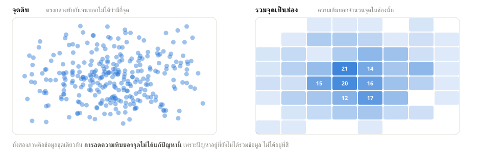

# บทที่ 14 — วาดข้อมูลลงแผนที่ด้วย deck.gl

บทนี้ไม่ได้อยู่ในคู่มือฉบับพิมพ์ เขียนเพิ่มเพราะ **แล็บสัปดาห์ที่ 9 ใช้เนื้อหาส่วนนี้ทั้งแล็บ**
ในเล่มเดิมมีพูดถึงแผนที่แค่บรรทัดเดียวในตารางหัวข้อ 6.5 เท่านั้น

## 14.1 เมื่อไรควรใช้แผนที่ และเมื่อไรไม่ควร

แผนที่เป็นกราฟที่คนชอบมากที่สุดและใช้ผิดบ่อยที่สุด เพราะมันดูน่าเชื่อถือแม้ตอนที่ไม่ได้บอกอะไรเลย

| ควรใช้แผนที่ | ไม่ควรใช้ |
|---|---|
| คำถามเกี่ยวกับ **ตำแหน่ง** เช่น ตรงไหนหนาแน่นกว่ากัน | คำถามเกี่ยวกับ **ปริมาณ** ที่ไม่เกี่ยวกับที่ตั้ง |
| อยากให้คนดูเห็นรูปทรงเชิงพื้นที่ที่ตารางบอกไม่ได้ | มีแค่ไม่กี่พื้นที่ ซึ่งกราฟแท่งอ่านง่ายกว่ามาก |
| ข้อมูลมีพิกัดจริง ไม่ใช่แค่ชื่อจังหวัด | เอาแผนที่มาใส่เพราะ "มันดูดี" |

> **กฎง่าย ๆ ที่ใช้ได้เกือบทุกครั้ง**
> ถ้าคำตอบของคำถามยังเหมือนเดิมเมื่อสลับตำแหน่งพื้นที่บนแผนที่ แปลว่าคุณไม่ได้ต้องการแผนที่
> คุณต้องการกราฟแท่ง

## 14.2 ข้อมูลต้องมีอะไรก่อนถึงจะวาดได้

Superset ต้องการ **พิกัดเป็นตัวเลข** สองคอลัมน์ คือละติจูดกับลองจิจูด

| สิ่งที่ต้องมี | หมายเหตุ |
|---|---|
| คอลัมน์ละติจูด (`LAT`) | ค่าอยู่ระหว่าง -90 ถึง 90 |
| คอลัมน์ลองจิจูด (`LON`) | ค่าอยู่ระหว่าง -180 ถึง 180 |
| ชนิดข้อมูลเป็นตัวเลข | ถ้าเป็นข้อความ ต้องแก้ที่หน้า Edit Dataset ก่อน |

> **อาการที่เจอบ่อยที่สุดคือใส่สองช่องนี้สลับกัน**
> ผลคือจุดทั้งหมดไปโผล่กลางมหาสมุทรอินเดีย เพราะละติจูด 100 ไม่มีอยู่จริง
> ระบบจะไม่ฟ้อง มันจะวาดให้ตามที่สั่ง **ถ้าเจออาการนี้ อย่าเพิ่งโทษข้อมูล ให้กลับไปดูสองช่องนี้ก่อน**

## 14.3 ปฏิบัติการที่ 1 จุดดิบด้วย deck.gl Scatterplot

ใช้ Dataset `san_francisco` ซึ่งเป็นที่อยู่ในเมืองซานฟรานซิสโก 261,552 แถว

1. เปิด Explore จาก Dataset นั้น แล้วเลือกชนิดกราฟ **deck.gl Scatterplot**
2. ที่ช่อง **Longitude & Latitude** เลือกแบบ `latitude/longitude columns`
3. ใส่ `LAT` ในช่องละติจูด และ `LON` ในช่องลองจิจูด
4. **Time Range** ตั้งเป็น `No filter`
5. **Row limit** เริ่มที่ `10000` ก่อน แล้วค่อยเพิ่ม
6. กด **Create chart**

> **ทำไมต้องเริ่มที่หนึ่งหมื่นจุดก่อน**
> การวาดสองแสนจุดใช้เวลาและแรงเครื่องมาก ถ้าตั้งค่าอะไรผิดแล้วต้องแก้
> คุณจะเสียเวลารอทุกครั้งที่กด Run ให้ตั้งค่าจนถูกก่อนด้วยข้อมูลน้อย ๆ แล้วค่อยเพิ่ม

## 14.4 ปัญหาจุดทับกัน (overplotting)

พอจุดเยอะขึ้น ตรงกลางเมืองจะกลายเป็นก้อนทึบก้อนเดียว **นับไม่ได้ว่ามีกี่จุด**

*ซ้ายคือจุดดิบ ขวาคือการรวมจุดเป็นช่อง ทั้งสองภาพคือข้อมูลชุดเดียวกัน*

สิ่งที่คนมักลองก่อนแล้วไม่ได้ผล

| วิธีที่มักลอง | ทำไมไม่ได้ผล |
|---|---|
| ลดความทึบของจุด | ช่วยได้นิดเดียว พอจุดทับกันสิบชั้นก็ทึบเหมือนเดิม |
| ลดขนาดจุด | อ่านตำแหน่งยากขึ้น แต่ตรงกลางยังนับไม่ได้อยู่ดี |
| เปลี่ยนสี | ไม่เกี่ยวกับปัญหาเลย |

**ปัญหาไม่ได้อยู่ที่การมองเห็น แต่อยู่ที่เรายังไม่ได้รวมข้อมูล**
สายตาคนนับของซ้อนกันไม่ได้ ต้องให้การคำนวณนับให้ก่อน แล้วค่อยวาดผลลัพธ์

## 14.5 ปฏิบัติการที่ 2 รวมจุดด้วย Grid หรือ Hexagon

1. สร้างกราฟใหม่จาก Dataset เดิม เลือกชนิด **deck.gl Grid** (หรือ **Hexagon**)
2. ตั้งช่องพิกัดเหมือนเดิม
3. ที่ช่อง **Metric** เลือก `COUNT(*)` ถ้าอยากนับจำนวนจุดในแต่ละช่อง
4. ลองปรับ **Grid size** ให้เล็กลงและใหญ่ขึ้นอย่างละครั้ง

หลักคิดคือ **แบ่งแผนที่เป็นช่อง แล้วนับค่าในแต่ละช่อง** สิ่งที่คนอ่านเห็นจึงกลายเป็น
"ความหนาแน่น" ซึ่งเป็นสิ่งที่อยากรู้จริง ๆ ตั้งแต่แรก

> **ขนาดช่องเปลี่ยนข้อสรุปได้จริง**
> ช่องใหญ่เกินไปจะรวมพื้นที่ที่ไม่เกี่ยวกันเข้าด้วยกัน จนดูเหมือนทั้งย่านหนาแน่นเท่ากัน
> ช่องเล็กเกินไปจะกลับไปเหมือนจุดดิบที่อ่านความหนาแน่นไม่ออก
> **ไม่มีขนาดที่ถูกเพียงขนาดเดียว** ต้องเลือกให้เข้ากับคำถาม และบอกคนอ่านว่าเลือกเท่าไร

## 14.6 ชนิด layer อื่นที่มีให้เลือก

| ชนิด | ใช้เมื่อ |
|---|---|
| **Scatterplot** | อยากเห็นตำแหน่งของแต่ละจุด และจุดไม่เยอะ |
| **Grid** / **Hexagon** | อยากเห็นความหนาแน่น จุดเยอะจนทับกัน |
| **Screengrid** | คล้าย Grid แต่ช่องคงขนาดบนหน้าจอ ไม่ใช่บนพื้นโลก |
| **Heatmap** | อยากเห็นความหนาแน่นแบบไล่สีนุ่ม ๆ ไม่เป็นช่อง |
| **Path** | ข้อมูลเป็นเส้นทาง เช่น เส้นรถไฟ |
| **Polygon** / **GeoJSON** | ข้อมูลเป็นพื้นที่ เช่น ขอบเขตเขต |

สำหรับแล็บสัปดาห์ที่ 9 ใช้แค่สองชนิดแรกก็พอ ที่เหลือรู้ไว้ว่ามีก็พอ

## 14.7 ข้อควรระวังก่อนเอาแผนที่ไปใช้จริง

> ### หัวใจของบทนี้
>
> **แผนที่นับสิ่งที่อยู่ในข้อมูล ไม่ได้นับสิ่งที่คุณคิดว่ามันนับ**
>
> แผนที่จาก `san_francisco` แสดง **ความหนาแน่นของที่อยู่ที่ถูกบันทึกไว้** ซึ่งไม่ใช่
> ความหนาแน่นของประชากร (ตึกแถวหลังหนึ่งมีที่อยู่เดียวแต่มีคนอยู่ร้อยคน)
> ไม่ใช่ความหนาแน่นของกิจกรรมในเมือง และไม่ใช่ความหนาแน่นของปัญหา
>
> คนอ่านจะสรุปเอาเองเสมอว่ามันนับสิ่งที่เขาสนใจ **หน้าที่ของคนทำคือเขียนกำกับให้ชัด
> ว่ากำลังนับอะไรอยู่** หนึ่งบรรทัดในกล่อง Markdown ป้องกันความเข้าใจผิดได้ทั้งแดชบอร์ด

**สามข้อที่ต้องเช็กก่อนส่งมอบแผนที่**

1. เขียนไว้หรือยังว่าสีเข้ม/ช่องสูง แปลว่าอะไร
2. เขียนไว้หรือยังว่าขนาดช่องเท่าไร
3. เขียนไว้หรือยังว่าข้อมูลมาจากไหนและเก็บเมื่อไร

---

[⟵ บทที่ 13 — ให้ AI ช่วยทำงานบน Superset ผ่าน MCP](./13-ai-กับ-superset-mcp.md) · [สารบัญ](./README.md)
